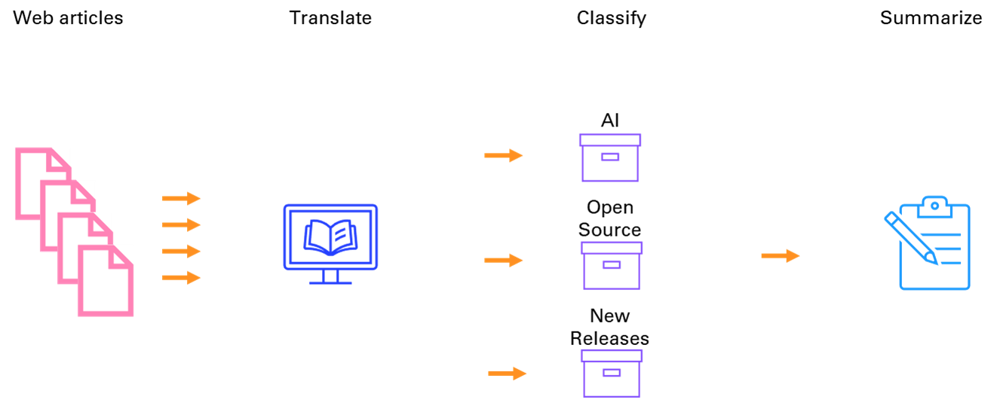

<a id="TMP_6afa"></a>

# LLMs with MATLAB

A practical guide to building Generative AI applications


Inspired from [programming\-GPTs](https://github.com/yanndebray/programming-GPTs)


This repo has been developed with MATLAB 24b and Python 3.10.


The code can be executed in MATLAB Online and MATLAB Desktop.


Some parts leverage other dev environments like VSCode and Jupyter. 

<!-- Begin Toc -->

## Table of Contents
&emsp;&emsp;[Preface](#TMP_8b14)
 
&emsp;&emsp;[Chap 1 \- Introducing LLMs](#TMP_97ba)
 
&emsp;&emsp;[Chap 2 \- OpenAI APIs](#TMP_6b40)
 
&emsp;&emsp;[Chap 3 \- the Art of Prompting](#H_4c6c)
 
&emsp;&emsp;[Chap 4 \- Question Answering](#TMP_4603)
 
&emsp;&emsp;[Chap 5 \- Agents and Tools](#TMP_7564)
 
&emsp;&emsp;[Chap 6 \- Speech to text and Text to speech](#TMP_4a51)
 
&emsp;&emsp;[Chap 7 \- Vision](#TMP_18c8)
 
&emsp;&emsp;[Chap 8 \- Image Generation](#TMP_6aa4)
 
&emsp;&emsp;[Chap 9 \- Appendix](#TMP_4783)
 
&emsp;&emsp;[Utils](#TMP_26e3)
 
<!-- End Toc -->
<a id="TMP_8b14"></a>

## Preface

Connect to the official MathWorks repo [matlab\-deep\-learning/llms\-with\-matlab](https://github.com/matlab-deep-learning/llms-with-matlab)


Setup your environment with dependencies and API keys.

```matlab
addpath preface\
setup
edit preface\setup.mlx
```
<a id="TMP_97ba"></a>

## Chap 1 \- Introducing LLMs

Pay attention to the way LLMs learn.

```matlab
addpath chap1_Introducing_LLMs\
attention
```


<a id="TMP_6b40"></a>

## Chap 2 \- OpenAI APIs

Make your first query in MATLAB.

```matlab
edit chap2_OpenAI_APIs\chap2_1_first_query.m
```

Learn to manage messages history.

```matlab
edit chap2_OpenAI_APIs\chap2_1_messages_history.mlx
```

Build your first chatbot, inspired by [toshiakit/MatGPT](https://github.com/toshiakit/MatGPT)


<a id="H_4c6c"></a>

## Chap 3 \- the Art of Prompting

Chain, transform, organize, summarize to process large amount of information with LLMs. Learn all the methods.


Build a tidy bookmarking system.




```matlab
edit chap3_Art_of_prompting\chap3_1_extract_content.m
edit chap3_Art_of_prompting\chap3_2_translate_articles.m
edit chap3_Art_of_prompting\chap3_3_classify_articles.m
edit chap3_Art_of_prompting\chap3_4_summarize_articles.m
edit chap3_Art_of_prompting\chap3_5_scale_processing.m
```
<a id="TMP_4603"></a>

## Chap 4 \- Question Answering

Retrieve relevant information to augment the response of LLMs.


```matlab
edit chap4_Question_answering\chap4_rag.mlx
edit chap4_Question_answering\chap4_embeddings.mlx
```
<a id="TMP_7564"></a>

## Chap 5 \- Agents and Tools

Choose the right tool for the job. Think about it in steps.


```matlab
edit chap5_Agents\chap5_OpenAI_functions.mlx
```
<a id="TMP_4a51"></a>

## Chap 6 \- Speech to text and Text to speech

Transcribe and synthetize information as you go.


Generate a daily tech podcast from your favorite website.


```matlab
edit chap6_stt_tts\chap6_stt.mlx
```
<a id="TMP_18c8"></a>

## Chap 7 \- Vision

Analyze images and videos, detect objects.


Build an Optical Character Recognition app.


```matlab
edit chap7_Vision\Chap7_Vision.mlx
edit chap7_Vision\Chap7_Detecting_cars.mlx
edit chap7_Vision\Chap7_OCR.mlx
edit chap7_Vision\Chap7_Video_understanding.mlx
```
<a id="TMP_6aa4"></a>

## Chap 8 \- Image Generation

Create, edit, vary. Let your creativity run loose.


```matlab
edit chap8_Image_generation\chap8_Image_generation.mlx
```
<a id="TMP_4783"></a>

## Chap 9 \- Appendix

Learn more about AI, machine learning, deep learning, natural language processing and transformers.


Run open\-source LLMs locally with Ollama.

```matlab
edit chap9_appendix\Chap9_Ollama.mlx
```
<a id="TMP_26e3"></a>

## Utils
```matlab
export README.mlx README.md;
```
