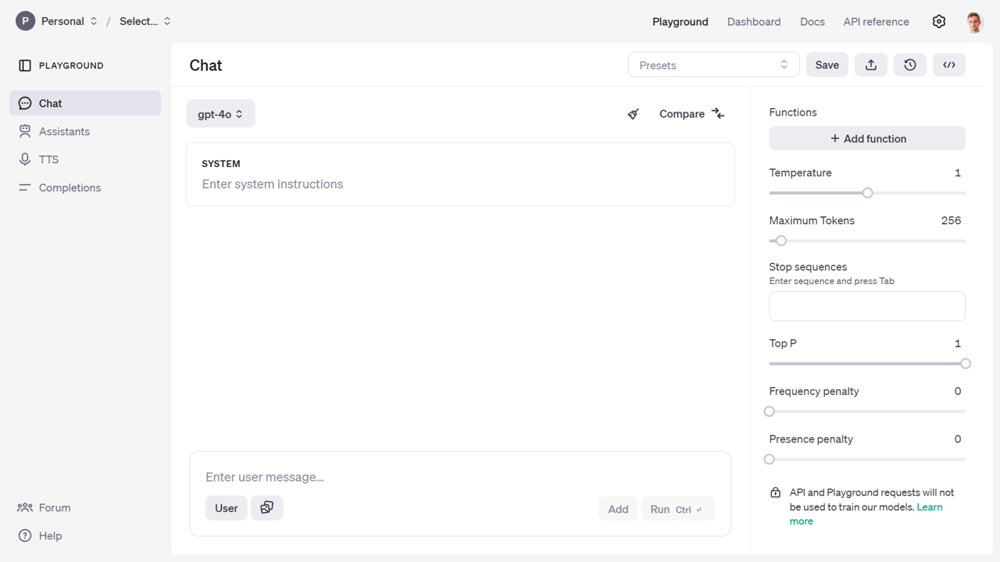
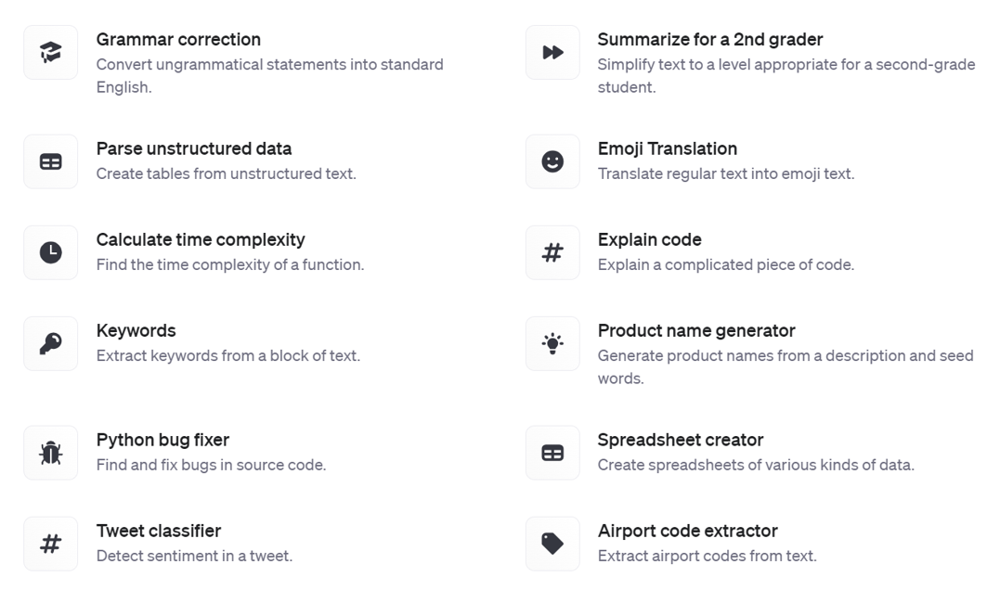

# LLMs with MATLAB and Python

In this chapter you will discover the main APIs that OpenAI provides to
interact with their GPT models.

## Quick tour of the OpenAI developer platform

First you will need to create an OpenAI account on their developer
platform (*platform.openai.com*). Once you are logged in to your OpenAI
account, the landing page of the developer platform will take you to a
playground that enables you to get access to different kinds of models.
The main kind of models are chat models on which I will focus for this
chapter. But you will see other kinds of models in the rest of the book,
like the Assistant and TTS (Text-To-Speech) models. Completion models
are now considered legacy.



Figure 2‑2 Play around in the playground and test the model APIs

This will give you an experience close to the one you have with the
ChatGPT web app. But from there you will be able to access more advanced
parameters of the model and view the code necessary to replicate the
call to the API from your own program. If you are lacking inspiration,
and you don't know where to start, you will find some prompt examples
from the presets in the documentation[^1].



Figure 2‑3 Prompt examples

If you want to take a guided look at the documentation[^2] before trying
anything or go lower level to the definition of the functions in the API
reference[^3].

Finally you can also access a dashboard to access management services:

-   *Assistants*: to create and manage your own assistant models

-   *Fine-tuning*: to fine-tune your own models

-   *Batches*: to manage your batch jobs

-   *Storage*: to manage files and vector stores

-   *Usage*: to give you a sense of your consumption of the OpenAI web
    services.

-   *API keys*: to manage your API keys

**/!\\** As an important data privacy disclaimer, API and
Playground requests will not be used to train OpenAI models. This isn't
the case of the public ChatGPT App, which by default can learn from
users' conversations.

## Getting started with the chat completion API

We already saw a simple example of passing a prompt and get a response.
This only works in single-turn chats. If you want to support multi-turn
chats, we need to use messages.

A message is made up of role and content. There are three distinct
roles: system, user, and assistant.

-   System: This is the initial instruction for the LLM that guides its subsequent responses and actions, known as "system prompt". It serves as context for the rest of the conversation, forcing the chat to behave in a certain way. Some developers have found success in continually moving the system message near the end of the conversation to keep the model's attention from drifting away as conversations get longer. You can set the system prompt when you initialize openAIChat.
```matlab
% Load environment variables and initialize the chat client with a system prompt
loadenv("path/to/.env");
chat = openAIChat("If I say hello, say world", ...
ApiKey=getenv("OPENAI_API_KEY"), ...
ModelName="gpt-4o-mini");
```
-   User: This is the prompt a user provides to the LLM.

-   Assistant: This is the response from the LLM.

To add your prompt, initialize OpenAIMessages and use addUserMessage to
add your message.
```matlab
% Initialize message history and add a user query
messages = messageHistory;
messages = addUserMessage(messages,"hello");
[txt,msgStruct,response] = generate(chat,messages);
disp(txt) % world
```
We can add the response to the messages using addResponseMessage to
continue the conversation without losing the previous exchanges.
```matlab
messages = addResponseMessage(messages, msgStruct);
```
Here is the content of messages:
```matlab
>> messages.Messages{1}

ans =

struct with fields:

role: "user"
content: "hello"

>> messages.Messages{2}

ans =

struct with fields:

role: "assistant"
content: "world"
```
As you can see from the messages object passed to the OpenAI chat client, it consists of a cell array of struct, each entry containing a
role (either *user* or *assistant*) and a content entry.


Let's save the messages in a .mat file in a "chat" folder for later use:
```matlab
save(fullfile("chat","convo1.mat"),"messages");
```

You can convert the messages to a table for better visualization:
```matlab

% Display the message history as a table
msgCells = messages.Messages;
msgStructArray = [msgCells{:}];
T = struct2table(msgStructArray);
disp(T)
```

The table output will look like:

|    |   role      | content      |
|----|-------------|--------------|
|  1 | "user"      | "hello"      |
|  2 | "assistant" | "world"      |


The messages can contain as many *user* and *assistant* exchanges as you
want, as long as you do not exceed the model's context window. For
GPT-4o[^4], the number of tokens accepted is 128k. Inputs and outputs
tokens are summed, but outputs cannot exceed 16,385 tokens.

Additional parameters can be passed when creating the OpenAI Chat client
or generating a response (like max number of tokens, number of responses
to generate, and streaming option).

[^1]: Prompt examples: [https://platform.openai.com/docs/examples](https://platform.openai.com/docs/examples)

[^2]: Doc: [platform.openai.com/docs](https://platform.openai.com/docs/overview)

[^3]: API Reference: [platform.openai.com/api-reference](https://platform.openai.com/api-reference)

[^4]: GPT-4o model: [https://platform.openai.com/docs/models/gpt-4o](https://platform.openai.com/docs/models/gpt-4o)
