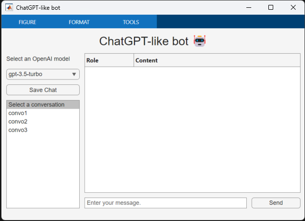
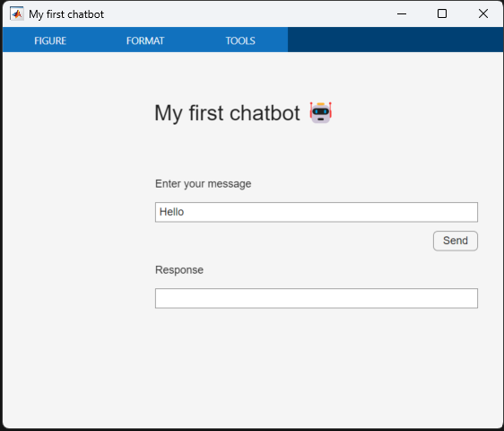
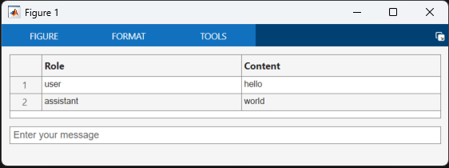
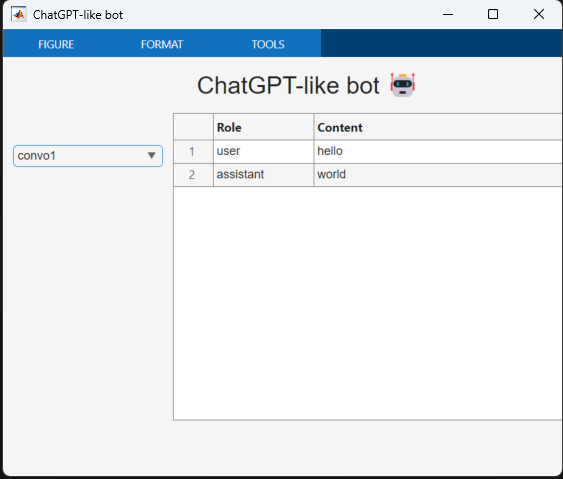

# Build your own MatGPT

In this chapter, you will learn how to build your first chatbot
chat_app.m. It will look like this:



We will break the development into the following steps:

1.  Define the graphical components of the app (**input field**,
    **button**, **dropdown**)

2.  Display the chat conversation in the main area (**output field**)

3.  Implement various functions (**new_chat**, **send**, **load_chat**,
    **dumb_chat**) for handling chat functionalities, and save the chat
    history as a .mat file

4.  Handle app data to share app state across callback functions

5.  Stream the conversation (**chat_stream**)

## Create a first chat graphical user interface

This part is going to focus more on the MATLAB app-building framework.
Typically, we use App Designer[^1] to design MATLAB apps interactively.
You can also create simple apps programmatically. Let's start with that
approach.



You create a MATLAB app by defining its graphical user interface. To
define its behavior, you add callback functions to its UI components.
This is the code for the first chat app in MATLAB:
```matlab
% create a UI figure window

fig = uifigure(Name="My first chatbot");

% add a 7x4 grid

g = uigridlayout(fig);

g.RowHeight = {'1x',22,22,22,22,22,'1x'};

g.ColumnWidth = {150,300,50,'1x'};

% add a title

ttl = uilabel(g,Text="My first chatbot 🤖");

ttl.HorizontalAlignment = "center";

ttl.FontSize = 24;

ttl.Layout.Row = 1;

ttl.Layout.Column = [1,3];

% add an input field

eflabel = uilabel(g,Text="Enter your message");

eflabel.Layout.Row = 2;

eflabel.Layout.Column = 2;

ef = uieditfield(g);

ef.Layout.Row = 3;

ef.Layout.Column = [2,3];

ef.Value = "Hello";

% add an output field

oflabel = uilabel(g,Text="Response");

oflabel.Layout.Row = 5;

oflabel.Layout.Column = 2;

of = uieditfield(g);

of.Layout.Row = 6;

of.Layout.Column = [2,3];

% add a button

btn = uibutton(g,Text="Send") ;

btn.ButtonPushedFcn=@(src,event) chat(ef,of);

btn.Layout.Row = 4;

btn.Layout.Column = 3;

% this function runs when the button is clicked

function chat(inputField,outputField)

systemPrompt = "If I say hello, say world";

% modify this depending on which release you use

client = openAIChat(systemPrompt, ...

ApiKey=getSecret("OPENAI_API_KEY"), ...

ModelName="gpt-4o-mini");

prompt = string(inputField.Value);

[txt,msgStruct,response] = generate(client,prompt);

if isfield(response.Body.Data,"error")

error(response.Body.Data.error)

else

outputField.Value = txt;

end

end
```

Please define all the local functions at the end of the script file
unless you use R2024a or later. In the latest versions of MATLAB, you
can define local functions anywhere in a script.

MATLAB apps are built on a UI figure[^2] window. It is a good practice
to add a UI grid layout[^3] to the UI figure to organize UI components
within the UI figure.

The basic elements that are useful for any basic app are the UI edit
field[^4] and the UI button[^5], which lets you define the app behavior
in a callback function.

We can gradually increase the complexity of the app, by adding a UI
dropdown[^6] to choose the model *before* the UI button definition:
```matlab
% add a dropdown before the button

items = ["gpt-4o-mini","gpt-4o"];

dd = uidropdown(g,Items=items);

dd.Layout.Row = 2;

dd.Layout.Column = 1;

We also need to update the callback function in the UI button to include
the UI dropdown to the input arguments.

% update the callback input arguments

btn.ButtonPushedFcn=@(src,event) chat(dd,ef,of));

Here is the updated function definition:

function chat(selection,inputField,outputField)

systemPrompt = "If I say hello, say world";

% modify this depending on which release you use

client = openAIChat(systemPrompt, ...

ApiKey=getSecret("OPENAI_API_KEY"), ...

ModelName=selection.Value);

prompt = string(inputField.Value);

[txt,msgStruct,response] = generate(client,prompt);

if isfield(response.Body.Data,"error")

error(response.Body.Data.error)

else

outputField.Value = txt;

end

end
```
## Chat elements

The simple app we just built can only handle a single-turn chat. To
support a multi-turn chat, we need to use a UI component that can show
multiple lines of text. One such component is the UI table[^7].
```matlab
% create a ui figure window

fig = figure;

fig.Position(end) = 150;

% add a 3x1 grid

g = uigridlayout(fig,[3,1]);

g.RowHeight = {80,22,'1x'};

% add a table

uit = uitable(g);

uit.Data = ["user","hello";"assistant","world"];

uit.ColumnName = ["Role","Content"];

uit.Layout.Row = 1;

% add an input field

ef = uieditfield(g,Placeholder="Enter your message");

ef.Layout.Row = 2;
```
As you can see from the structure of the code, the rendering of the
messages will be done after a new message has been added to the Data
property of the UI table. Please note that the input field is placed
below the table with a placeholder text.



## Chat functions

In order to start building a chat that has more than one question and
one answer (not much of a chat), we will need to save the conversation
and load it back.

First let's start by loading an existing conversation, with a function
called **load_chat** that loads a chat history for debugging:
```matlab
function load_chat(dropdown,outputField)

historyfile = fullfile("chat", dropdown.Value + ".mat");

if isfile(historyfile)

load(historyfile,"convo");

roles = cellfun(@(x) string(x.role), convo.Messages');

contents = cellfun(@(x) string(x.content), convo.Messages');

outputField.Data = [roles,contents];

else

outputField.Data = [];

end

end
```
The chat history is stored in a .mat file in the chat folder. The chat
history is loaded from the file and then displayed in the output field.

We also need a function to populate the dropdown with available
filenames.
```matlab
function list_history(inputField)

if isfolder("chat")

s = dir("chat");

isMat = arrayfun(@(x) endsWith(x.name,".mat"), s);

filenames = arrayfun(@(x) string(x.name), s(isMat));

else

mkdir("chat");

filenames = [];

end

items = "Select a conversation";

if ~isempty(filenames)

filenames = extractBefore(filenames,".mat");

items = [items,filenames'];

end

inputField.Items = items;

end
```


You can call those functions as follows.
```matlab
fig = uifigure(Name="ChatGPT-like bot");

% add a 8x5 grid

g = uigridlayout(fig);

g.RowHeight = {'1x',22,22,22,'5x',22,22,5};

g.ColumnWidth = {150,100,200,'1x',100};

ttl = uilabel(g,Text="ChatGPT-like bot 🤖");

ttl.FontSize = 24;

ttl.Layout.Row = 1;

ttl.Layout.Column = [1,5];

ttl.HorizontalAlignment = "center";

% add a table to show the conversation

uit = uitable(g);

uit.ColumnWidth = {100,'1x'};

uit.ColumnName = ["Role","Content"];

uit.Layout.Row = [2,6];

uit.Layout.Column = [2,5];

% add a dropdown

dd = uidropdown(g);

list_history(dd);

dd.ValueChangedFcn = @(src,event) load_chat(dd,uit);

dd.Layout.Row = 3;

dd.Layout.Column = 1;
```
Second let's define the chat function. While designing the behavior of
the app, I'd recommend avoid calling OpenAI each time by creating a
dummy chat function:
```matlab
function dumb_chat(inputField,dropdown,convo)

prompt = string(inputField.Value);

convo = addUserMessage(convo,prompt);

txt = "Hello world";

msgStruct = struct("role","assistant","content",txt);

convo = addResponseMessage(convo,msgStruct);

save_chat(convo,"convo1");

list_history(dropdown);

end
```
We need to output the conversation outside of the function. However,
this function is called from a button click, so there is no direct way
to output the conversation to use elsewhere. To solve this problem, we
save the conversation to a local file using the save_chat function:
```matlab
function save_chat(convo,filename)

historyfile = fullfile("chat", filename + ".mat");

save(historyfile,"convo");

end
```
You can implement additional UI components and logic to accept user
input and save the conversation to a file.
```matlab
% add an input field

ef = uieditfield(g,Placeholder="Enter your message.");

ef.Layout.Row = 7;

ef.Layout.Column = [2,4];

% add a send button

sendBtn = uibutton(g,Text="Send");

sendBtn.ButtonPushedFcn=@(src,event) dumb_chat(ef,dd,openAIMessages);

sendBtn.Layout.Row = 7;

sendBtn.Layout.Column = 5;
```
When you send your message by clicking on the button, the conversation
is saved in the "convo1.mat" file and you can display it by selecting
"convo1" in the dropdown.

## Building the conversation

In the previous chapter, we've seen how to save and load a conversation.
But we don't want to write to disk each turn of the chat. We need
another mechanism to store the app state. It is a good time to discover
how to memorize the elements from the app.

When we design an app, we need to store app data to be shared across
various callback functions. The best way to store data is to use the
UserData property of the top-level UI figure, because it is accessible
from all other UI components. In our example, we need to manage the
state of the conversation as it is loaded, updated and saved.

By storing the conversation in the UserData property of the UI figure,
we can access it from any child component using ancestor[^8] function:
```matlab
fig = ancestor(uicomponent,"figure","toplevel");

fig.UserData
```
Let's see how this works in the updated dumb_chat function:
```matlab
function dumb_chat(inputField,outputField)

% use ancestor to get the fig

fig = ancestor(inputField,"figure","toplevel");

% get the messages from the UserData property of the fig

convo = fig.UserData;

prompt = string(inputField.Value);

if isempty(outputField.Data)

outputField.Data = ["user",prompt];

else

outputField.Data = [outputField.Data;"user",prompt];

end

convo = addUserMessage(convo,prompt);

txt = "Hello world";

msgStruct = struct("role","assistant","content",txt);

convo = addResponseMessage(convo,msgStruct);

% update the UserData property of the fig

fig.UserData = convo;

outputField.Data = [outputField.Data;"assistant",txt];

inputField.Value = "";

end
```
The save_chat function is no longer used in the dumb_chat function.
Let's repurpose it so that it can be called from a button.
```matlab
function save_chat(inputField,outputField)

fig = ancestor(inputField,"figure","toplevel");

convo = fig.UserData;

if ~isempty(convo.Messages)

% create a new filename based on the folder content

s = dir("chat");

isMat = arrayfun(@(x) endsWith(x.name,".mat"), s);

filenames = arrayfun(@(x) string(x.name), s(isMat));

if isempty(filenames)

filename = "convo1";

else

filenames = extractBefore(filenames,".mat");

suffix = str2double(extractAfter(filenames,"convo"));

filename = "convo" + (max(suffix) + 1);

end

historyfile = fullfile("chat", filename + ".mat");

save(historyfile,"convo");

list_history(inputField);

end

% reset the UserData and output field

fig.UserData = openAIMessages;

outputField.Data = [];

end
```
Then you need to initialize the UserData property of the UI figure when
you build the app:
```matlab
% initialize the UserData property in the UI figure

fig = uifigure(Name="ChatGPT-like bot");

fig.UserData = openAIMessages;
```
Let's add a new button that called the save_chat function before the
"Send" button.
```matlab
% add a save chat button

saveBtn = uibutton(g,Text="Save Chat");

saveBtn.ButtonPushedFcn=@(src,events) save_chat(uit,dd);

saveBtn.Layout.Row = 4;

saveBtn.Layout.Column = 1;
```
We also need to update the input arguments for the callback function for
the input field:
```matlab
% modify the function input arguments

sendBtn.ButtonPushedFcn=@(src,event) dumb_chat(ef,uit);
```

## Stream the response

Finally, one small thing is missing to make the app look and feel just
like ChatGPT. We will modify the call to the OpenAI chat completion API,
by adding the parameter StreamFun.

Setting StreamFun in a client makes the model return tokens as soon as
they are available, instead of waiting for the full sequence of tokens
to be generated. It does not change the time to get all the tokens, but
it reduces the time for the first token for an application where we want
to show partial progress or are going to stop generations. This can be a
better user experience and a UX improvement so it's worth experimenting
with streaming.

Here is the code that replaces the dumb_chat function:
```matlab
function chat_stream(dropdown,inputField,outputField)

% modify this depending on which release you use

client = openAIChat(ModelName=dropdown.Value, ...

ApiKey=getSecret("OPENAI_API_KEY"), ...

StreamFun=@(x) printStream(outputField,x));

fig = ancestor(inputField,"figure","toplevel");

convo = fig.UserData;

prompt = string(inputField.Value);

if isempty(outputField.Data)

outputField.Data = ["user",prompt];

else

outputField.Data = [outputField.Data; "user",prompt];

end

convo = addUserMessage(convo,prompt);

[txt,msgStruct,response] = generate(client,convo);

convo = addResponseMessage(convo,msgStruct);

if isfield(response.Body.Data,"error")

error(response.Body.Data.error)

else

fig.UserData = convo;

outputField.Data(end) = txt;

inputField.Value = "";

end

end
```
Additionally, we need to define the function for the StreamFun
parameter:
```matlab
function printStream(h,x)

data = string(h.Data);

if strlength(x) == 0

data = [data; "assistant",string(x)];

else

data(end) = data(end) + string(x);

end

h.Data = data;

pause(0.1)

end
```
Let's update the dropdown so that we can use it to choose a model:
```matlab
% replace the dropdown

ddlabel = uilabel(g,Text="Select an OpenAI model");

ddlabel.Layout.Row = 2;

ddlabel.Layout.Column = 1;

dd = uidropdown(g,Items=["gpt-4o-mini","gpt-4o"]);

dd.Layout.Row = 3;

dd.Layout.Column = 1;

% replace dumb_chat with chat_stream

sendBtn.ButtonPushedFcn=@(src,events) chat_stream(dd,ef,uit);
```
Now you should be able to stream the response from the API.

Before we finish, we need to make one more change. Since we updated the
dropdown to select a model, we lost the ability to load a chat history.
Let's add a few more things to complete the app.
```matlab
% add a listbox

lb = uilistbox(g);

list_history(lb);

lb.ValueChangedFcn = @(src,events) load_chat(lb,uit);

lb.Layout.Row = [5,7];

lb.Layout.Column = 1;
```
We also need to update some functions.
```matlab
function load_chat(listbox,outputField)

historyfile = fullfile("chat", listbox.Value + ".mat");

if isfile(historyfile)

load(historyfile,"convo");

fig = ancestor(outputField,"figure","toplevel");

fig.UserData = convo;

roles = cellfun(@(x) string(x.role), convo.Messages');

contents = cellfun(@(x) string(x.content), convo.Messages');

outputField.Data = [roles,contents];

else

outputField.Data = [];

end

end
```
Congratulations 🎉 You have created your first chatbot. If you assemble
the learnings from the previous sections, you will be able to replicate
the code in this example in chat_app.m.

## Deploy your App on MATLAB Online

When you create something cool, it is natural that you want to share it
with others, and the web is the most convenient way to make it
accessible. At the same time, sharing code on the web can be very tricky
if you are not familiar with web programming.

MATLAB apps run on MATLAB Online and you can use the "focus mode"[^9] so
that your app runs standalone on the web browser, without the clutter of
MATLAB GUI. I think this is a very powerful alternative to creating a
web app and you can code everything in MATLAB and don't have to deal
with the complexity of serving web apps.

[^1]: <https://www.mathworks.com/help/matlab/app-designer.html>

[^2]: <https://www.mathworks.com/help/matlab/ref/uifigure.html>

[^3]: <https://www.mathworks.com/help/matlab/ref/uigridlayout.html>

[^4]: <https://www.mathworks.com/help/matlab/ref/uieditfield.html>

[^5]: <https://www.mathworks.com/help/matlab/ref/uibutton.html>

[^6]: <https://www.mathworks.com/help/matlab/ref/uidropdown.html>

[^7]: <https://www.mathworks.com/help/matlab/ref/uitable.html>

[^8]: <https://www.mathworks.com/help/matlab/ref/ancestor.html>

[^9]: <https://www.mathworks.com/products/matlab-online/focused-view.html>
