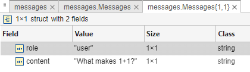

# Chap 2 \- Messages history

```matlab
loadenv("../.env");
modelName = "gpt-4o-mini";
chat = openAIChat("You are a MATLAB expert.",ModelName=modelName);
```

The message history is structured as follow




```matlab
messages = messageHistory;
query = "What makes 1+1?";
messages = addUserMessage(messages, query)
```

```matlabTextOutput
messages = 
  messageHistory with properties:

    Messages: {[1x1 struct]}

```

```matlab
messages.Messages{1}
```

```matlabTextOutput
ans = struct with fields:
       role: "user"
    content: "What makes 1+1?"

```

```matlab
[text, response] = generate(chat, messages);
messages = addResponseMessage(messages, response)
```

```matlabTextOutput
messages = 
  messageHistory with properties:

    Messages: {[1x1 struct]  [1x1 struct]}

```

```matlab
messages.Messages{2}
```

```matlabTextOutput
ans = struct with fields:
       role: "assistant"
    content: "In mathematics, \(1 + 1\) equals \(2\). This is a basic arithmetic operation where you are adding the number one to itself, resulting in two."

```

```matlab
% Extract the cell array of structs
msgCells = messages.Messages;

% Concatenate the cell array into a struct array
msgStructArray = [msgCells{:}];

% Convert the struct array into a table
T = struct2table(msgStructArray)
```
| |role|content|
|:--:|:--:|:--:|
|1|"user"|"What makes 1+1?"|
|2|"assistant"|"In mathematics, \\(1 + 1\\) equals \\(2\\). This is a basic arithmetic operation where you are adding the number one to itself, resulting in two."|

