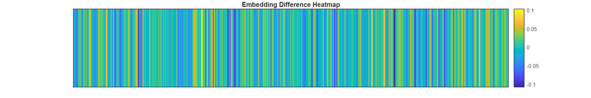

<a id="T_6c81"></a>

# Chap 4 \- Embeddings
<!-- Begin Toc -->

## Table of Contents
&emsp;&emsp;[OpenAI embedding service](#H_9a9d)
 
&emsp;&emsp;[Semantic similarity](#H_7c0b)
 
&emsp;&emsp;[Open\-source embedding model](#H_2a81)
 
&emsp;&emsp;[Plotting embeddings](#H_122a)
 
&emsp;&emsp;[Vector Search](#H_06bf)
 
&emsp;&emsp;[Utils](#H_23b6)
 
<!-- End Toc -->

Resource: [A Tale of Two Cities by Charles Dickens | Project Gutenberg](https://www.gutenberg.org/ebooks/98)

```matlab
% Define the paragraph as a string literal using concatenation for readability
paragraph = "It was the best of times, it was the worst of times, " + ...
    "it was the age of wisdom, it was the age of foolishness, " + ...
    "it was the epoch of belief, it was the epoch of incredulity, " + ...
    "it was the season of Light, it was the season of Darkness, " + ...
    "it was the spring of hope, it was the winter of despair, " + ...
    "we had everything before us, we had nothing before us, " + ...
    "we were all going direct to Heaven, we were all going direct the other way " + ...
    "- in short, the period was so far like the present period, " + ...
    "that some of its noisiest authorities insisted on its being received, " + ...
    "for good or for evil, in the superlative degree of comparison only.";

% Split the paragraph into sentences using ", " as the delimiter
sentences = split(paragraph, ", ");

% Select the first sentence (MATLAB indexing starts at 1)
sentence1 = sentences(1)
```

```matlabTextOutput
sentence1 = "It was the best of times"
```

<a id="H_9a9d"></a>

## OpenAI embedding service
```matlab
emb = extractOpenAIEmbeddings(sentence1)
```

```matlabTextOutput
emb = 1x1536
    0.0100   -0.0019    0.0083   -0.0402   -0.0179    0.0026   -0.0008   -0.0045   -0.0127   -0.0410    0.0035    0.0257    0.0134   -0.0020    0.0047    0.0106    0.0423    0.0003   -0.0036   -0.0005   -0.0047    0.0214    0.0023   -0.0077   -0.0109    0.0012    0.0026   -0.0274    0.0306   -0.0002   -0.0005   -0.0038   -0.0222   -0.0073   -0.0333   -0.0561   -0.0322   -0.0087    0.0070    0.0050    0.0131   -0.0067   -0.0031    0.0237   -0.0276    0.0074    0.0137    0.0051   -0.0172    0.0015

```

```matlab
size(emb)
```

```matlabTextOutput
ans = 1x2
           1        1536

```

```matlab
embs = extractOpenAIEmbeddings(sentences)
```

```matlabTextOutput
embs = 18x1536
    0.0100   -0.0019    0.0083   -0.0402   -0.0179    0.0026   -0.0008   -0.0045   -0.0127   -0.0410    0.0035    0.0257    0.0134   -0.0020    0.0047    0.0106    0.0423    0.0003   -0.0036   -0.0005   -0.0047    0.0214    0.0023   -0.0077   -0.0109    0.0012    0.0026   -0.0274    0.0306   -0.0002   -0.0005   -0.0038   -0.0222   -0.0073   -0.0333   -0.0561   -0.0322   -0.0087    0.0070    0.0050    0.0131   -0.0067   -0.0031    0.0237   -0.0276    0.0074    0.0137    0.0051   -0.0172    0.0015
   -0.0169    0.0028    0.0003   -0.0268   -0.0102    0.0076   -0.0040   -0.0052   -0.0151   -0.0424    0.0038    0.0312    0.0170    0.0168   -0.0017    0.0100    0.0420    0.0116    0.0040    0.0043    0.0018    0.0244   -0.0022    0.0017   -0.0106   -0.0002    0.0091   -0.0296    0.0303   -0.0143   -0.0144   -0.0099   -0.0159   -0.0165   -0.0405   -0.0398   -0.0019   -0.0112    0.0035   -0.0126    0.0120   -0.0123    0.0014    0.0238   -0.0453    0.0028   -0.0000   -0.0136   -0.0255    0.0024
    0.0282   -0.0129   -0.0060   -0.0285   -0.0036   -0.0019   -0.0106   -0.0226   -0.0045   -0.0446    0.0247    0.0188    0.0031    0.0067   -0.0115    0.0132    0.0423    0.0151    0.0261    0.0054   -0.0047    0.0149    0.0009   -0.0283   -0.0080   -0.0102    0.0087   -0.0324   -0.0054   -0.0296   -0.0021   -0.0126   -0.0037   -0.0161   -0.0439   -0.0313   -0.0173   -0.0273    0.0151   -0.0040    0.0034   -0.0228   -0.0093    0.0044   -0.0161    0.0110   -0.0140   -0.0179   -0.0139    0.0137
    0.0003   -0.0149   -0.0127   -0.0267   -0.0187   -0.0051   -0.0229   -0.0172    0.0033   -0.0335    0.0241    0.0149   -0.0081    0.0131    0.0014    0.0050    0.0384    0.0152    0.0164    0.0059    0.0011    0.0146    0.0008   -0.0205   -0.0140   -0.0027    0.0107   -0.0293   -0.0046   -0.0171    0.0050   -0.0217   -0.0003   -0.0021   -0.0431   -0.0426   -0.0186   -0.0249    0.0048   -0.0082    0.0099   -0.0122   -0.0126    0.0114   -0.0151    0.0070   -0.0042   -0.0126   -0.0048    0.0179
    0.0040   -0.0022   -0.0138   -0.0280   -0.0126    0.0026   -0.0057   -0.0042    0.0087   -0.0188    0.0083    0.0117   -0.0011    0.0046   -0.0130    0.0276    0.0361    0.0187   -0.0137    0.0088   -0.0091    0.0133    0.0064   -0.0211   -0.0034   -0.0175    0.0140   -0.0302   -0.0167   -0.0079   -0.0202   -0.0240   -0.0100   -0.0143   -0.0239   -0.0590   -0.0240   -0.0120    0.0115    0.0171    0.0035   -0.0050   -0.0072   -0.0024   -0.0122    0.0156    0.0058   -0.0077   -0.0089    0.0136
   -0.0018   -0.0064   -0.0154   -0.0252   -0.0136    0.0060   -0.0018   -0.0230   -0.0025   -0.0216    0.0227    0.0138   -0.0002    0.0037   -0.0169    0.0176    0.0418    0.0247   -0.0014   -0.0100   -0.0196    0.0131   -0.0049   -0.0176   -0.0121   -0.0090    0.0127   -0.0348   -0.0171   -0.0190   -0.0204   -0.0130   -0.0056   -0.0139   -0.0299   -0.0492   -0.0155   -0.0192   -0.0081    0.0026    0.0091    0.0002   -0.0161    0.0069   -0.0263    0.0106    0.0035   -0.0065   -0.0113    0.0270
    0.0127   -0.0126   -0.0045   -0.0108   -0.0064    0.0091   -0.0158   -0.0206   -0.0095   -0.0392    0.0310    0.0304   -0.0179    0.0033   -0.0058    0.0049    0.0280   -0.0018    0.0063   -0.0052   -0.0022    0.0146   -0.0085   -0.0055    0.0071   -0.0096    0.0186   -0.0385    0.0039   -0.0108   -0.0011   -0.0172   -0.0168   -0.0132   -0.0295   -0.0273   -0.0090   -0.0041    0.0071   -0.0161    0.0010    0.0027   -0.0127    0.0091   -0.0170    0.0300    0.0230   -0.0149    0.0075    0.0065
    0.0102   -0.0267   -0.0039   -0.0146   -0.0182    0.0104   -0.0105   -0.0215   -0.0105   -0.0377    0.0208    0.0325   -0.0026   -0.0088   -0.0070    0.0103    0.0250    0.0124    0.0116   -0.0077    0.0072    0.0297    0.0053   -0.0077    0.0019   -0.0058    0.0137   -0.0366    0.0053   -0.0062   -0.0025   -0.0222   -0.0101   -0.0144   -0.0342   -0.0235   -0.0179   -0.0140    0.0032   -0.0120   -0.0049   -0.0044   -0.0160    0.0047   -0.0219    0.0243    0.0237   -0.0083    0.0021    0.0072
   -0.0074   -0.0073   -0.0156   -0.0276   -0.0040    0.0134    0.0095   -0.0114   -0.0114   -0.0240    0.0143    0.0124   -0.0240   -0.0083   -0.0022    0.0000    0.0285   -0.0226    0.0112   -0.0159    0.0097   -0.0093    0.0027   -0.0076   -0.0041   -0.0103    0.0275   -0.0376    0.0011   -0.0173   -0.0073   -0.0054   -0.0458   -0.0136   -0.0306   -0.0290   -0.0100   -0.0094    0.0214   -0.0182   -0.0030    0.0006   -0.0062   -0.0067   -0.0261    0.0019    0.0041    0.0029   -0.0007    0.0227
   -0.0085   -0.0216   -0.0061   -0.0384   -0.0172    0.0105   -0.0103    0.0025   -0.0087   -0.0454    0.0150    0.0262    0.0004    0.0148   -0.0081    0.0072    0.0373    0.0079    0.0110   -0.0309    0.0098    0.0096   -0.0054   -0.0088   -0.0062   -0.0197    0.0205   -0.0366    0.0217   -0.0154   -0.0101   -0.0120   -0.0171   -0.0207   -0.0325   -0.0482   -0.0146   -0.0101   -0.0016   -0.0182    0.0162   -0.0073   -0.0090    0.0106   -0.0251    0.0219   -0.0012   -0.0001   -0.0120    0.0225

```

<a id="H_7c0b"></a>

## Semantic similarity

Since the norm of the vector embeddings is 1, cosine similarity between the vectors results in a simple dot product.

```matlab
norm(emb)
```

```matlabTextOutput
ans = 1.0000
```

```matlab
dot(embs(1,:),embs(2,:))
```

```matlabTextOutput
ans = 0.9032
```

```matlab
sentences(1),sentences(2)
```

```matlabTextOutput
ans = "It was the best of times"
ans = "it was the worst of times"
```

<a id="H_2a81"></a>

## Open\-source embedding model
```matlab
model = documentEmbedding(Model='all-MiniLM-L6-v2'); % or 'all-MiniLM-L12-v2'
embedding1 = model.embed(sentence1)
```

```matlabTextOutput
embedding1 = 1x384
   -0.0452    0.0716    0.0172   -0.0316    0.0476   -0.0080    0.0121    0.0578   -0.0236    0.0006   -0.0058    0.1645    0.0872    0.0575   -0.0096    0.0257    0.0318    0.0048   -0.0224   -0.0381   -0.0567   -0.0271    0.0124    0.0493    0.0092    0.0300    0.0072    0.0636   -0.0289    0.0344   -0.0391   -0.0202    0.0009    0.0116   -0.0567    0.0033    0.0108   -0.0678    0.0246   -0.0009    0.0038   -0.0342   -0.0243   -0.0845    0.0169    0.0033    0.0806   -0.0888    0.0559    0.0244

```

<a id="H_122a"></a>

## Plotting embeddings
```matlab
plotSingleEmbedding(embedding1)
```


```matlab
embedding2 = model.embed(sentences(2));
plotAlignedEmbeddings(embedding1, embedding2)
```


```matlab
plotDifferenceEmbeddings(embedding1,embedding2)
```



Process the whole paragraph in one call

```matlab
embeddings = model.embed(sentences)
```

```matlabTextOutput
embeddings = 18x384
   -0.0452    0.0716    0.0172   -0.0316    0.0476   -0.0080    0.0121    0.0578   -0.0236    0.0006   -0.0058    0.1645    0.0872    0.0575   -0.0096    0.0257    0.0318    0.0048   -0.0224   -0.0381   -0.0567   -0.0271    0.0124    0.0493    0.0092    0.0300    0.0072    0.0636   -0.0289    0.0344   -0.0391   -0.0202    0.0009    0.0116   -0.0567    0.0033    0.0108   -0.0678    0.0246   -0.0009    0.0038   -0.0342   -0.0243   -0.0845    0.0169    0.0033    0.0806   -0.0888    0.0559    0.0244
   -0.0179    0.0900    0.0614    0.0197    0.0309   -0.0213   -0.0139    0.0841    0.0107   -0.0358    0.0154    0.1339    0.1108    0.0546   -0.0694   -0.0224    0.0375    0.0035    0.0180   -0.0036   -0.0355   -0.0124   -0.0353    0.0255   -0.0102    0.0027   -0.0059    0.0635   -0.0383   -0.0343   -0.0256   -0.0044    0.0252   -0.0202   -0.0247   -0.0452    0.0569   -0.0063    0.0123   -0.0201    0.0279    0.0338   -0.0167   -0.0620    0.0128   -0.0207    0.0707   -0.0854    0.0063   -0.0028
    0.0115    0.1453   -0.0250    0.0861    0.0218    0.0727    0.0062   -0.0320    0.0247    0.0400    0.0389    0.1092    0.0812   -0.0237   -0.0629    0.0052   -0.0982   -0.0788   -0.0081   -0.0668   -0.0765    0.0948    0.0109    0.0070   -0.0023    0.0765   -0.0715   -0.0701    0.0491    0.0528    0.0749    0.0018    0.1240   -0.0115   -0.0627   -0.0103    0.0828    0.0665   -0.0051    0.0436   -0.0237   -0.0292   -0.0738    0.0147    0.0136    0.0060   -0.0323   -0.0267    0.0304    0.0135
    0.0222    0.1374    0.0226    0.0028    0.0270    0.0363    0.0270    0.0188   -0.0718    0.0882    0.0402    0.0571    0.0676   -0.0381   -0.0405   -0.0435   -0.0842   -0.0809    0.0107   -0.0067   -0.0194    0.0279    0.0371   -0.0100    0.0045    0.0424   -0.0100   -0.0831   -0.0228    0.0525    0.0592    0.0706    0.1249   -0.0446    0.0022   -0.0911    0.1030    0.0772   -0.0079   -0.0178   -0.0084   -0.0374   -0.0664    0.0062   -0.0470   -0.0470    0.0143    0.0186    0.0549    0.0165
    0.0058    0.0807   -0.0328    0.0436    0.0082    0.0102   -0.0338    0.0035    0.0423   -0.0191    0.0493    0.0541    0.0520   -0.0159   -0.0416   -0.0290   -0.1071    0.0007   -0.0234   -0.0370   -0.0947   -0.0025   -0.0258    0.0345    0.0540    0.0574    0.0381   -0.0778    0.0771    0.0566    0.0246    0.0027    0.0931   -0.0264   -0.0120    0.0251    0.0717    0.0157   -0.0055   -0.0300   -0.0150   -0.0263    0.0353   -0.0441    0.0087    0.0053    0.0316    0.0314   -0.0464    0.0137
    0.0124    0.1272   -0.0086   -0.0326   -0.0071   -0.0321   -0.0382    0.0622   -0.0943   -0.0379    0.0757    0.0009    0.0705   -0.0552   -0.0609   -0.0555   -0.0620   -0.0289   -0.0716    0.0006   -0.0011    0.0285   -0.0071    0.0604    0.0812    0.0664   -0.0015   -0.0409    0.0384    0.0344   -0.0073   -0.0369    0.0434   -0.0227    0.0074   -0.0009    0.0788   -0.0043    0.0386   -0.0536   -0.0382   -0.0020   -0.0127   -0.0031    0.0014   -0.0261    0.0149   -0.0092   -0.0490    0.0009
   -0.0417    0.0505    0.0091    0.1127    0.0306    0.0303    0.0198   -0.0042   -0.0077   -0.0210    0.0710    0.0109    0.0338    0.0059   -0.0168    0.0052   -0.0106   -0.0229    0.0395   -0.0210    0.0410   -0.0298   -0.0557    0.0471    0.0179    0.0487   -0.0185    0.0011   -0.0483    0.0184    0.0609    0.0810    0.0059    0.0248   -0.0187   -0.0066    0.0142   -0.0689    0.0112    0.0737   -0.0578   -0.0996   -0.0169   -0.0076   -0.0481    0.0345    0.0329   -0.0158    0.0167    0.0195
   -0.0321    0.0753   -0.0412    0.1430   -0.0116    0.0357   -0.0109   -0.0116    0.0612   -0.0652    0.0395   -0.0197    0.0588   -0.0267   -0.0552   -0.0222    0.0381    0.0664    0.0526   -0.0603    0.0132    0.0328   -0.0227   -0.0189    0.0152    0.0541   -0.0384   -0.0563   -0.0431    0.0040    0.0256    0.0472    0.0143    0.0082    0.0284   -0.0277    0.0317   -0.0297   -0.0455    0.0879   -0.0510   -0.0274   -0.0338   -0.0089   -0.1021    0.0359   -0.0054   -0.0114    0.0366   -0.0296
   -0.0033    0.0856    0.0212    0.0226    0.0688    0.0395    0.0045    0.0009    0.0463   -0.0246    0.0135    0.0773    0.0652   -0.0571   -0.0044   -0.0182   -0.0953   -0.0650    0.0135    0.0426   -0.0236    0.0108   -0.0297    0.0601   -0.0089    0.0309    0.0123    0.0508   -0.0290    0.0357    0.0090   -0.0127   -0.0006   -0.0557   -0.0025    0.0218    0.0166   -0.0074   -0.0460   -0.0097   -0.0380    0.0038    0.0201    0.0308    0.0167    0.0340    0.0844   -0.0595   -0.0135   -0.0174
   -0.0086    0.1587    0.0244    0.1033    0.0134    0.0445    0.0342    0.0547   -0.0070   -0.0556   -0.0532    0.0018    0.1040   -0.0367   -0.0412    0.0092   -0.0737   -0.0341    0.0837   -0.0181    0.0072    0.0615   -0.0537    0.0033   -0.0311    0.0639   -0.0625    0.0495   -0.0519    0.0416   -0.0247    0.0370    0.0186    0.0037    0.0233    0.0447    0.0649   -0.0069   -0.0258    0.0058    0.0100    0.0363   -0.0430    0.0001   -0.0202   -0.0273   -0.0092   -0.0019    0.0399   -0.0473
   -0.0531    0.0631    0.0662    0.0594    0.0310   -0.0045    0.0122   -0.0601    0.0212   -0.0110    0.0578    0.0705    0.0489    0.0020   -0.0236   -0.0394   -0.0141   -0.0846   -0.1117   -0.0055   -0.0743   -0.0169   -0.0425   -0.0227    0.0455    0.0399   -0.0473    0.0189    0.1005   -0.0441    0.0627   -0.0389    0.1193    0.0050    0.0015    0.0138    0.0614   -0.0170    0.0336   -0.0248   -0.0321   -0.0411   -0.0154    0.0263   -0.0318    0.0991    0.0540   -0.0444    0.0619    0.0540
   -0.0632    0.0504    0.0253    0.0673    0.0032    0.0202    0.0144   -0.0716    0.0602   -0.0360    0.0752    0.0160    0.0409    0.0140   -0.0403   -0.0302    0.0108   -0.1077   -0.0901    0.0149   -0.0533   -0.0263   -0.0215   -0.0156    0.0058   -0.0076   -0.0139    0.0138    0.0998   -0.0213    0.0531   -0.0378    0.1222   -0.0331    0.0293    0.0219    0.0635   -0.0022    0.0117    0.0247   -0.0241   -0.0533   -0.0335    0.0373   -0.0129    0.0710    0.0096   -0.0177    0.0367    0.0372
    0.0838    0.0181   -0.0216   -0.0010    0.0453   -0.0344    0.0096   -0.1015    0.0525    0.0048    0.0587   -0.0271    0.0287   -0.0247    0.0230   -0.0838   -0.0368   -0.0567   -0.0708   -0.0489   -0.0239    0.1144   -0.0350    0.0598    0.0045    0.0921    0.0108   -0.0001    0.0332    0.0066   -0.0480   -0.0705   -0.0914   -0.0345   -0.0160    0.0587    0.0525   -0.0969    0.0086   -0.0246    0.0390    0.0313   -0.0270    0.0716    0.0063    0.0520   -0.0497   -0.0409    0.0425    0.0047
    0.0672   -0.0515    0.0141    0.0056    0.0497   -0.0509   -0.0353   -0.0214    0.0158    0.0093    0.0540    0.0250    0.0005   -0.0245    0.0223   -0.0476   -0.0249   -0.0359   -0.0358    0.0158   -0.0074    0.0721    0.0030    0.0563    0.0188    0.0103    0.0216    0.0250    0.0296    0.0185   -0.0173    0.0193   -0.0997   -0.0333   -0.0657    0.0185    0.0526   -0.0169    0.0230   -0.0481    0.0367    0.0485    0.0102    0.0625   -0.0598    0.0651   -0.0282   -0.0928   -0.0360    0.0278
   -0.0172    0.0450   -0.0057   -0.0148   -0.0142    0.0454   -0.1239   -0.0396   -0.0339    0.0454    0.0328    0.0257   -0.0195   -0.0331    0.0437   -0.0433   -0.0177   -0.0411    0.0638    0.0847    0.0064    0.0291    0.0251    0.0004    0.0597    0.0815   -0.0054   -0.0309    0.0051    0.0318    0.0022    0.0648   -0.0153   -0.0642    0.0096    0.0091    0.0617    0.0217    0.0042   -0.0682   -0.0194    0.0506    0.0601    0.0369    0.0258    0.0202    0.0285    0.0056    0.0071    0.0446

```

<a id="H_06bf"></a>

## Vector Search

Let's use Facebook AI Similarity Search (FAISS)

```matlab
d = py.int(384); % Dimension of the embeddings
index = py.faiss.IndexFlatL2(d);
index.add(embeddings)
```

```matlab
% Save the index to a file
py.faiss.write_index(index, "charles.index");
```

```matlab
% Later, load the index from the file
index = py.faiss.read_index("charles.index");
```

```matlab
% Encode the sentence "good times"
query_sentence = "good times";
query_embedding = model.embed(query_sentence);

% Convert query_embedding to a numpy array and reshape to [1, 384]
query_embedding = py.numpy.reshape(query_embedding, py.tuple({py.int(1), d}));

k = py.int(5);  % Number of nearest neighbors to retrieve
res = index.search(query_embedding, k);
distance = double(res{1})
```

```matlabTextOutput
distance = 1x5
    0.6443    0.8690    1.4095    1.4118    1.4287

```

```matlab
indices = int64(res{2})
```

```matlabTextOutput
indices = 1x5 int64 row vector
    0    1   10    8   16

```

```matlab
disp("Nearest neighbors (smaller is better):")
```

```matlabTextOutput
Nearest neighbors (smaller is better):
```

```matlab
% Loop over the number of neighbors returned.
% Note: FAISS returns 0-indexed indices, so add 1 for MATLAB indexing.
for i = 1:size(indices, 2)
    idx = indices(1, i) + 1;  
    % Use either sentences{idx} (if sentences is a cell array)
    % or sentences(idx) (if sentences is a string array)
    fprintf("Sentence: %s, Distance: %f\n", sentences{idx}, distance(1, i));
end
```

```matlabTextOutput
Sentence: It was the best of times, Distance: 0.644333
Sentence: it was the worst of times, Distance: 0.868980
Sentence: we had everything before us, Distance: 1.409483
Sentence: it was the spring of hope, Distance: 1.411791
Sentence: for good or for evil, Distance: 1.428674
```

<a id="H_23b6"></a>

## Utils

Function to visualize a single embedding as a heatmap

```matlab
function plotSingleEmbedding(embedding)
    % Create a figure with a custom size (in pixels)
    figure('Position', [100, 100, 1200, 200]);

    % Display the data as a heatmap
    imagesc(embedding);
    
    % Set a colormap 
    colormap("parula");
    
    % Remove y-axis ticks
    set(gca, 'YTick', []);
    
    % Add a colorbar to the side of the heatmap
    colorbar;
    
    % Set the title of the plot
    title('Single Embedding Heatmap');
end
```

Function to plot embeddings aligned

```matlab
function plotAlignedEmbeddings(embedding1, embedding2)
    % Stack the embeddings for aligned visualization 
    % (each embedding is assumed to be a row vector)
    aligned_embeddings = [embedding1; embedding2];
    
    % Create a figure with a custom size (in pixels)
    figure('Position', [100, 100, 1200, 200]);

    % Display the data as a heatmap
    imagesc(aligned_embeddings);
    
    % Set colormap
    colormap("parula");
    
    % Set the y-axis ticks to correspond to the two embeddings
    set(gca, 'YTick', [1, 2], 'YTickLabel', {'Embedding 1', 'Embedding 2'});
    
    % Remove x-axis ticks
    set(gca, 'XTick', []);
    
    % Add a colorbar to the side of the heatmap
    colorbar;
    
    % Set the title of the plot
    title('Aligned Embeddings Heatmap');
end
```

Function to compare one embedding over another

```matlab
function plotDifferenceEmbeddings(embedding1, embedding2)
    % Compute the difference between the embeddings
    difference = embedding1 - embedding2;
    
    % Create a figure with a custom size (in pixels)
    figure('Position', [100, 100, 1200, 200]);

    % Display the data as a heatmap
    imagesc(difference);
    
    % Set colormap 
    colormap(parula);
    
    % Remove x-axis and y-axis ticks for cleaner visualization
    set(gca, 'XTick', []);
    set(gca, 'YTick', []);
    
    % Add a colorbar to the side of the heatmap
    colorbar;
    
    % Set the title of the plot
    title('Embedding Difference Heatmap');
end
```
