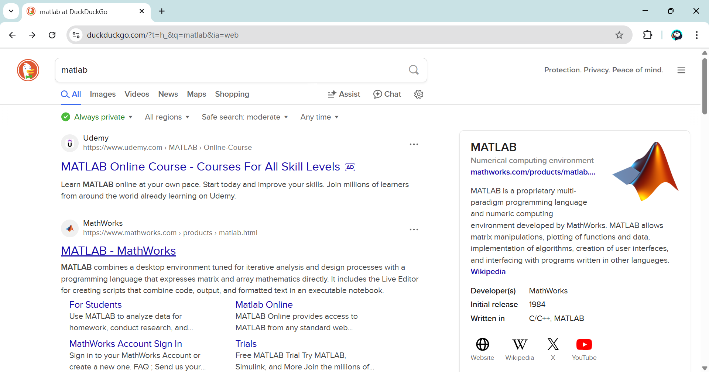
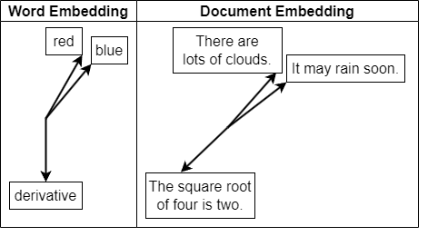

<a id="TMP_57bb"></a>

# Chap 4 \- Retrieval Augmented Generation
<!-- Begin Toc -->

## Table of Contents
&emsp;&emsp;[Context lag](#TMP_1f2e)
 
&emsp;&emsp;[Traditional Search](#TMP_31e8)
 
&emsp;&emsp;[Similarity Search](#TMP_24a9)
 
&emsp;&emsp;[Vector Search](#TMP_0025)
 
&emsp;&emsp;[Utils](#TMP_16e3)
 
&emsp;&emsp;[Resources](#TMP_52c9)
 
<!-- End Toc -->
<a id="TMP_1f2e"></a>

## Context lag
```matlab
prompt = "Who is the CEO of Twitter?";
model = openAIChat(ModelName="gpt-4o-mini-search-preview");
response = generate(model,prompt)
```

```matlabTextOutput
response = "As of my last update in October 2023, Elon Musk was the CEO of Twitter. However, please verify with up-to-date sources, as leadership positions can change frequently."
```

<a id="TMP_31e8"></a>

## Traditional Search

DuckDuckGo can be used as a free search engine, as it provides an API that enables to parse the search results as JSON without API key (alternative exists based on Google and other search engines).





[https://duckduckgo.com/?q=matlab&ia=web](https://duckduckgo.com/?q=matlab&ia=web)


Here is an example of a similar query, but made this time to the DuckDuckGo API programmatically.

```matlab
% Set up the query
query = "what is MATLAB?";
% URL encode the query string to handle special characters and spaces
query = urlencode(query)
```

```matlabTextOutput
query = 'what+is+MATLAB%3F'
```

```matlab
% Construct the base URL for the DuckDuckGo API
url = "https://api.duckduckgo.com/?format=json&q="+query;
% Make the API request
options = weboptions('ContentType', 'json');
res = webread(url, options);

% Display the response title and abstract
disp("Heading: " + res.Heading)
```

```matlabTextOutput
Heading: MATLAB
```

```matlab
disp("Abstract: " + res.Abstract)
```

```matlabTextOutput
Abstract: MATLAB is a proprietary multi-paradigm programming language and numeric computing environment developed by MathWorks. MATLAB allows matrix manipulations, plotting of functions and data, implementation of algorithms, creation of user interfaces, and interfacing with programs written in other languages. Although MATLAB is intended primarily for numeric computing, an optional toolbox uses the MuPAD symbolic engine allowing access to symbolic computing abilities. An additional package, Simulink, adds graphical multi-domain simulation and model-based design for dynamic and embedded systems. As of 2020, MATLAB has more than four million users worldwide. They come from various backgrounds of engineering, science, and economics. As of 2017, more than 5000 global colleges and universities use MATLAB to support instruction and research.
```


Parse the first result.

```matlab
wiki = webread(res.AbstractURL);
context = extractHTMLText(wiki);
```

Use the context of the search result to provide a response.

```matlab
prompt = ["Based on the following context, answer the query:";
          "-------";
          "Context:";
           context;
          "-------";
          "Query:";
           query];
prompt = strjoin(prompt,newline);
model = openAIChat();
response = generate(model,prompt)
```

```matlabTextOutput
response = "MATLAB is a proprietary multi-paradigm programming language and numerical computing environment developed by MathWorks. The name "MATLAB" stands for "MATrix LABoratory," and it is designed primarily for numeric computation but can also facilitate matrix manipulations, plotting of functions and data, implementation of algorithms, and creating user interfaces. MATLAB supports various functionalities, including interfacing with programs written in other languages, and has optional toolboxes for symbolic computing and graphical multi-domain simulation through Simulink. It can run on multiple operating systems such as Windows, macOS, and Linux. MATLAB is widely used across various fields, including engineering, science, and economics."
```


This API only provides instant results, not full search.


For this, let's use the Python package `duckduckgo-search`

```matlab
query = "Who's the last CEO of Twitter?";
T = search(query)
```


| |title|href|body|
|:--:|:--:|:--:|:--:|
|1|"Parag Agrawal - Wikipedia"|"https://en.wikipedia.org/wiki/Parag_Agrawal"|"Parag Agrawal (Hindi pronunciation: [pəˈɾaːɡ əɡɾəˈʋaːl]; born 21 May 1984) [2] is an Indian-born American software engineer and businessman who was the CEO of Twitter, Inc. from November 2021 to October 2022."|
|2|"Jack Dorsey - Wikipedia"|"https://en.wikipedia.org/wiki/Jack_Dorsey"|"Jack Patrick Dorsey (born November 19, 1976) [3] is an American businessperson, who is a co-founder of Twitter, Inc. and its CEO during 2007-2008 and 2015-2021, as well as co-founder, principal executive officer and chairman of Block, Inc. (developer of the Square financial services platform)."|
|3|"Here are the executives that have exited Twitter - The Hill"|"https://thehill.com/policy/technology/3709207-here-are-the-executives-that-have-exited-twitter/"|"Agrawal's tenure as CEO followed that of Jack Dorsey, who stepped down from the position last year. Dorsey co-founded the platform in 2006 and was CEO until 2008."|
|4|"Twitter has had 5 CEOs in 17 years, Linda Yaccarino may be company's ..."|"https://www.indiatoday.in/technology/features/story/twitter-has-had-5-ceos-in-17-years-linda-yaccarino-may-be-companys-6th-ceo-2378312-2023-05-12"|"Twitter has had five different CEOs since its inception in 2006, with the most recent being Parag Agrawal, who was removed by Elon Musk in October 22, soon after he acquired the social media company in a \$44 billion deal. The company's first CEO was Evan Williams, who founded Twitter in 2006."|
|5|"Who is Parag Agarwal? - The new CEO of Twitter - Business Standard"|"https://www.business-standard.com/about/who-is-parag-agrawal"|"Parag Agrawal is an Indian-American CEO of Twitter Inc. He was elevated to the post after Twitter founder and CEO Jack Dorsey stepped down in November 2021. In the past, Agarwal was the Chief Technology Officer (CTO) for the social media firm. He is the youngest CEO leading a Standard & Poor's (S&P) 500 company and is also part of a select group of CEOs of Indian origin heading technology ..."|
|6|"Elon Musk names Linda Yaccarino new Twitter boss - BBC"|"https://www.bbc.com/news/business-65574826"|"Elon Musk has named a new chief executive of Twitter, just over six months after his controversial takeover of the social media company."|
|7|"New Twitter CEO steps from behind the scenes to high profile"|"https://apnews.com/article/parag-agrawal-twitter-new-ceo-3e7e1c7c0c6d60777feae0b2bf8bd5a2"|"Newly named Twitter CEO Parag Agrawal (PUH-rag AH-gur-wahl) has emerged from behind the scenes to take over one of Silicon Valley's highest-profile and politically volatile jobs."|
|8|"Twitter CEO Jack Dorsey steps down, replaced by CTO Parag Agrawal"|"https://nypost.com/2021/11/29/twitter-ceo-jack-dorsey-expected-to-step-down/"|"Twitter founder Jack Dorsey said Monday he'd step down as CEO after a series of missteps — including the censoring of a bombshell story on Hunter Biden — and a share price that stubbornly ..."|
|9|"Jack Dorsey is stepping down as CEO of Twitter - CNN"|"https://www.cnn.com/2021/11/29/tech/jack-dorsey-twitter/index.html"|"Jack Dorsey, the cofounder and public face of Twitter, will step down from his role as CEO, effective immediately, the company announced Monday. Dorsey will remain a member of Twitter's board ..."|
|10|"Twitter has a new mystery CEO \| The Verge"|"https://www.theverge.com/2023/5/11/23517090/elon-musk-twitter-ceo-replacement"|"Elon Musk has found his replacement as CEO of Twitter Twitter will be under new management — but the same ownership. How much will change, and how fast?"|


```matlab
writetable(T,"search_results.csv")
```

```matlab
T = search(query,3);
for i = 1:3 %height(T)
    c = extractHTMLText(webread(T.href(i)));
    T.content(i) = string(c);
end
T
```


| |title|href|body|content|
|:--:|:--:|:--:|:--:|:--:|
|1|"Parag Agrawal - Wikipedia"|"https://en.wikipedia.org/wiki/Parag_Agrawal"|"Agrawal held research internships at Microsoft Research and Yahoo! Research before joining Twitter as a software engineer in 2011. [16] In October 2017, Twitter announced the appointment of Agrawal as chief technology officer following the departure of Adam Messinger. [17] In December 2019, Twitter CEO Jack Dorsey announced that Agrawal would be in charge of Project Bluesky, an initiative to ..."|"From Wikipedia, the free encyclopedia <br>Former CEO of Twitter (born 1984) <br>Parag Agrawal <br>Agrawal in 2005 <br>Born   (1984-05-21) 21 May 1984 (age 40)<br>Ajmer, Rajasthan, India <br>Education   Indian Institute of Technology, Bombay (BTech)<br>Stanford University (MS, PhD)  <br>Known for   Former CEO, Twitter, Inc.  <br>Predecessor   Jack Dorsey  <br>Successor   Elon Musk[1]  <br>Spouse  Vineeta Agarwala  <br>Children  2  <br>Scientific career  <br>Thesis  Incorporating Uncertainty in Data Management and Integration (2012)  <br>Doctoral advisor   Jennifer Widom  <br>Parag Agrawal (<br>Hindi pronunciation: [pəˈɾaːɡ əɡɾəˈʋaːl]; born 21 May 1984)[2] is an Indian-born American software engineer and businessman who was the CEO of Twitter, Inc. from November 2021 to October 2022.[3] <br>Early life and education<br>[edit] <br>Agrawal was born in Ajmer, Rajasthan.[4][5] His father was a senior official in the Indian Department of Atomic Energy and his mother is a retired Economics professor from Veermata Jijabai Technological Institute in Mumbai.[6]<br>He completed his Secondary Schooling at Atomic Energy Central School No.4 and in 2001, he completed his HSC at Atomic Energy Junior College, Mumbai.[7] In the same year, he secured a gold medal in the International Physics Olympiad held in Antalya, Turkey.[8][9]<br>In 2005, Agrawal obtained his BTech degree in Computer Science and Engineering from IIT Bombay.[10] That year, he moved to the United States to pursue a PhD in computer science at Stanford University under the guidance of Jennifer Widom.[11][12][13] His Stanford doctoral thesis, published in 2012, is titled "Incorporating Uncertainty in Data Management and Integration".[14][15]<br>Career<br>[edit] <br>Agrawal held research internships at Microsoft Research and Yahoo! Research before joining Twitter as a software engineer in 2011.[16] In October 2017, Twitter announced the appointment of Agrawal as chief technology officer following the departure of Adam Messinger.[17] In December 2019, Twitter CEO Jack Dorsey announced that Agrawal would be in charge of Project Bluesky, an initiative to develop a decentralized social network protocol.[18]<br>In an interview discussing the rise of misinformation on Twitter with MIT Technology Review in November 2020, while still Twitter CTO, when asked about freedom of speech regarding Twitter, Agrawal said: "Our role is not to be bound by the First Amendment, but our role is to serve a healthy public conversation ... [and to] focus less on thinking about free speech, but thinking about how the times have changed."[19]<br>On November 29, 2021, Dorsey announced that he was resigning as CEO of Twitter and that Agrawal was replacing him immediately.[20][21][22] As CEO, Agrawal was awarded annual compensation of \$1 million as well as stock compensation worth \$12.5 million.[11] Agrawal was fired as CEO once Elon Musk completed his acquisition of the company on October 27, 2022.[23][24]<br>Post-Twitter, Agrawal founded an artificial intelligence startup aimed at developing software for large language models (LLMs). The company received \$30 million in funding from Khosla Ventures, Index Ventures, and First Round Capital.[25]<br>Personal life<br>[edit] <br>Agrawal is married to Vineeta Agarwala,[26] general partner at the venture capital firm Andreessen Horowitz, where she focuses on investments in biotech and health tech.[27] They have two children,[28] and reside in San Francisco.[26]<br>References<br>[edit] <br>^ "Elon Musk officially becomes Twitter CEO and dissolves board of directors". Euronews. 1 November 2022.<br>^  "Parag Agrawal: Ajmer Celebrates a Son 'More Powerful than PMs, Presidents'". The Times of India. 30 November 2021. <br>^  Conger, Kate; Hirsch, Lauren (27 October 2022). "Elon Musk Completes \$44 Billion Deal to Own Twitter". The New York Times. Retrieved 30 October 2022. <br>^  "अजमेर के रहने वाले हैं ट्विटर के नए CEO:किराए पर रहता था परिवार, 4 दिसंबर को घर आएंगे पराग के मम्मी-पापा" [The new CEO of Twitter is from Ajmer:The family used to live on rent, Parag's parents will come home on 4 December]. Dainik Bhaskar (in Hindi). 30 November 2021. <br>^  Isaac, Mike; Conger, Kate; Met, Cade (29 November 2021). "Who Is Parag Agrawal, Twitter's New C.E.O.?". The New York Times. ISSN 0362-4331. <br>^  "THIS is why Twitter's new CEO Parag Agrawal kept his son's name Ansh". MSN. 12 February 2021. <br>^  "Twitter CEO Parag Agrawal's teachers call him 'typical topper' with special calibre". The Indian Express. 2 December 2021. Retrieved 20 April 2022. <br>^  Damle, Manjiri (13 August 2001). "Indians bag 5 medals at physics Olympiad". The Times of India. Retrieved 28 October 2022. <br>^  "IPhO: India - Individual Results". ipho-unofficial.org. Retrieved 28 October 2022. <br>^  "Bright Student, Well Organized: How Teachers Remember IIT Bombay Alumnus, Twitter CEO Parag Agarwal". News18. 30 November 2021. <br>^ a b  "Parag Agrawal becomes Twitter CEO: Who is Parag Agrawal? Here is a brief profile of this IITian in 5 points". India Today. 29 November 2021. <br>^  Rajghatta, Chidanand (30 November 2021). "IIT-Bombay alumnus Parag Agrawal is Twitter CEO after Dorsey exit". The Times of India. <br>^  Chhapia, Hemali; Doval, Pankaj (30 November 2021). "When Parag Agrawal regretted wasting time tying IIT-JEE supplements". The Times of India. <br>^  Agrawal, Parag (2012). "Incorporating Uncertainty in Data Management and Integration". Stanford University. <br>^  Spangler, Todd (29 November 2021). "Who Is Parag Agrawal? A Look at Twitter's New CEO". Variety. <br>^  Novet, Jordan (9 March 2018). "Twitter taps distinguished engineer Parag Agrawal as new CTO". CNBC. <br>^  "Things To Know About New Twitter CEO, Parag Agrawal, From IIT Bombay". News18. 30 November 2021. <br>^  Mathews, Eva (30 November 2021). "Who is Parag Agrawal, Twitter's new CEO?". The Times of India. Reuters. <br>^  "EmTech Stage: Twitter's CTO on misinformation". MIT Technology Review. 18 November 2020. <br>^  Huddleston Jr., Tom (30 November 2021). "Twitter's new 37-year-old CEO went from Twitter engineer to CEO in just 10 years". CNBC. Retrieved 28 October 2022. <br>^  Molina, Brett (29 November 2021). "Jack Dorsey steps down as Twitter CEO, Parag Agrawal named as successor, sends stock surging". USA Today. <br>^  Feiner, Lauren; Bursztynsky, Jessica (29 November 2021). "Twitter CTO Parag Agrawal will replace Jack Dorsey as CEO". CNBC. <br>^  Dang, Sheila; Roumeliotis, Greg (27 October 2022). "Musk starts his Twitter ownership with firings, declares the 'bird is freed'". Reuters. Archived from the original on 28 May 2023. Retrieved 28 October 2022. <br>^  Vanian, Jonathan (28 October 2022). "Elon Musk now in charge of Twitter, CEO and CFO have left, sources say". CNBC. Archived from the original on 28 October 2022. Retrieved 28 October 2022. <br>^  "Former Twitter CEO Parag Agrawal Raises \$30 Million For New AI Startup: Report". NDTV.com. Retrieved 25 July 2024. <br>^ a b  "Who Is Vineeta Agarwala, And How Is Elon Musk Twitter Buyout Linked To CEO Parag Agrawal Wife". www.india.com. Retrieved 25 July 2024. <br>^  Akhtar, Allana (29 November 2021). "Meet Twitter's new CEO: a 37-year-old machine learning and AI expert". Business Insider. <br>^  Sadeque, Samira (17 February 2022). "Twitter CEO's weeks-long paternity leave hailed by fellow dads". The Guardian. <br>External links<br>[edit] <br>Parag Agrawal on Twitter <br>Authority control databases  <br>International   <br>VIAF<br>National   <br>Germany<br>v <br>t <br>e <br>Twitter <br>Twitter, Inc. <br>X Corp. <br>Twitter under Elon Musk <br>People   <br>Jack Dorsey <br>Noah Glass <br>Biz Stone <br>Evan Williams <br>Dick Costolo <br>Parag Agrawal <br>Elon Musk <br>Linda Yaccarino <br>Technology   <br>Bluesky <br>Community Notes <br>Favstar <br>Features  <br>Verification <br>FlockDB <br>Gnip <br>Seesmic <br>Services and applications  <br>Hootsuite <br>Tweetbot <br>TweetDeck <br>Twitterrific <br>Statistics  <br>Most-followed accounts <br>Most-retweeted tweets <br>Most-liked tweets <br>Tween <br>Tweet <br>Tweetie <br>Twimight <br>TwitPic <br>Culture   <br>Black Twitter <br>dril <br>Criticism of <br>Frogtwitter <br>Milkshake Duck <br>Headquarters <br>Stan Twitter <br>Trends <br>Twitterature <br>Twitter bomb <br>Twitter bot <br>Twitter diplomacy <br>History   <br>2020 account hijacking <br>Acquisition by Elon Musk <br>Censorship  <br>Brazil <br>Nigeria <br>Republik Twitter<br>Mergers and acquisitions  <br>BackType <br>Bluefin Labs <br>Dasient <br>Gnip <br>Mitro <br>Namo Media <br>Posterous <br>Summify <br>Trendrr <br>TweetDeck <br>Tweetie <br>Vine <br>Whisper Systems <br>Periscope <br>Suspensions  <br>December 2022 <br>Topsy Labs <br>Twitter Files <br>Twitter, Inc. v. Taamneh<br>Usage  <br>public figures <br>WikiLeaks-related court orders <br>Retrieved from "https://en.wikipedia.org/w/index.php?title=Parag_Agrawal&oldid=1286033444" <br>Categories:  <br>1984 births <br>American chief technology officers <br>American technology chief executives <br>Businesspeople from Rajasthan <br>Indian emigrants to the United States <br>IIT Bombay alumni <br>Living people <br>People from Ajmer <br>Stanford University alumni <br>Twitter, Inc. people <br>Hidden categories:  <br>CS1 Hindi-language sources (hi) <br>Articles with short description <br>Short description is different from Wikidata <br>Use dmy dates from January 2025 <br>Use Indian English from January 2025 <br>All Wikipedia articles written in Indian English <br>Articles with hCards <br>Pages with Hindi IPA"|
|2|"Jack Dorsey - Wikipedia"|"https://en.wikipedia.org/wiki/Jack_Dorsey"|"Jack Patrick Dorsey (born November 19, 1976) [3] is an American businessperson, who is a co-founder of Twitter, Inc. and its CEO during 2007-2008 and 2015-2021, as well as co-founder, principal executive officer and chairman of Block, Inc. (developer of the Square financial services platform). He is also the founder of Bluesky.. As of December 2024, Forbes estimated his net worth to be \$5. ..."|"From Wikipedia, the free encyclopedia <br>American internet entrepreneur <br>Jack Dorsey <br>Dorsey in 2014 <br>Born   <br>Jack Patrick Dorsey <br>(1976-11-19) November 19, 1976 (age 48)<br>St. Louis, Missouri, U.S. <br>Occupation   <br>Businessperson<br>Known for   Co-founding Twitter, Inc. and Block, Inc.  <br>Board member of   <br>Block, Inc.[1]<br>Berggruen Institute's Governance Center[2] <br>Jack Patrick Dorsey (born November 19, 1976)[3] is an American businessperson, who is a co-founder of Twitter, Inc. and its CEO during 2007–2008 and 2015–2021, as well as co-founder, principal executive officer and chairman of Block, Inc. (developer of the Square financial services platform). He is also the founder of Bluesky.<br>As of December 2024, Forbes estimated his net worth to be \$5.6 billion.[4]<br>Early life<br>[edit] <br>Dorsey was born and raised in St. Louis, Missouri.[5][6] His father is Tim Dorsey and his mother is Marcia (née Smith) Dorsey.[7][8] Jack Dorsey is partly of Italian descent on his mother's side.[9] His father worked for a company that developed mass spectrometers and his mother was a homemaker.[10] He was raised Catholic, and his uncle is a Catholic priest in Cincinnati.[11]<br>Dorsey attended Bishop DuBourg High School. In his younger days, he worked occasionally as a fashion model.[12] By age 14, he had become interested in dispatch routing. Dorsey enrolled at the University of Missouri–Rolla in 1995 and attended for two-plus years[11] before transferring to New York University in 1997, but he dropped out two years later, one semester short of graduating.[13] He came up with the idea that eventually became Twitter while studying at New York University.[14]<br>While working on dispatching as a programmer, Dorsey moved to California.[15][16] In 2000, Dorsey started his company in Oakland to dispatch couriers, taxis, and emergency services from the Web.[17] His other projects and ideas at this time included networks of medical devices and a "frictionless service market".[17] In July 2000, building on dispatching[18] and inspired in part by LiveJournal and by AOL Instant Messenger, he had the idea for a Web-based realtime status/short message communication service.[17]<br>When he first saw implementations of instant messaging, Dorsey wondered whether the software's user status output could be shared easily among friends.[18] He approached Odeo, which at the time happened to be interested in text messaging.[18] Dorsey and Biz Stone decided that SMS text suited the status-message idea, and built a prototype of Twitter in about two weeks.[18] The idea attracted many users at Odeo and investment from Evan Williams,[18] a co-founder of that firm in 2005 who had left Google after selling Pyra Labs and Blogger.<br>Career<br>[edit] <br>Twitter<br>[edit] <br>Main article: Twitter <br>Dorsey in 2008   <br>Noah Glass, Evan Williams, and Biz Stone co-founded Odeo, later renamed Obvious Corporation, which then spun off Twitter, Inc. Dorsey became Twitter's chief executive officer (CEO) when it was founded in 2007.[18][19][20] As CEO, Dorsey saw the startup through two rounds of funding by venture capitalists.[20] As the service began to grow in popularity, Dorsey chose the improvement of uptime as top priority,[21] even over creating revenue—which, as of 2008, Twitter was not designed to earn.[22] Dorsey described the commercial use of Twitter and its API as two things that could lead to paid features.[22] His three guiding principles, which he says the company shares, are simplicity, constraint, and craftsmanship.[22]<br>Dorsey lost his position as CEO in 2008, reportedly for leaving work early to enjoy other pursuits, such as yoga and fashion design.[23] On October 16, 2008,[24] Williams took over as CEO, while Dorsey became chairman of the board.[25][26] During his time as chairman, Dorsey joined several State Department delegations, including a trip to Iraq in April 2009, led by Jared Cohen.[27][28][29] In November, when Iranians took to the streets in the Green Revolution, Twitter was scheduled to conduct maintenance of its site, which would entail temporarily shutting down Twitter's servers. Dorsey responded to a request from Cohen to delay the maintenance so that it would not affect the revolution in Iran, because Iranians were using Twitter to communicate and coordinate.[30] Since President Obama had announced that there would be no meddling in Iran, the move sparked controversy.[31][32][33] In February 2010, Dorsey was part of another State Department delegation, this time to Russia.[34][35] In March 2011, he returned to Twitter as executive chairman after Dick Costolo replaced Williams as CEO.[36] In July 2015, Costolo resigned as CEO, with Dorsey assuming the post of interim CEO.[37] He was named permanent CEO in October 2015.[38]<br>Dorsey and President Barack Obama at Twitter Town Hall in July 2011   <br>In May 2016, Dorsey announced that Twitter would not count photos and links in the 140-character limit to free up more space for text. This was an attempt to entice new users, since the number of tweets per day had dropped from about 500 million in September 2013 and its peak of 661 million in August 2014 to about 300 million in January 2016.[39]<br>On November 22, 2016, Dorsey was briefly suspended from his own Twitter account with 3.9 million followers. After restoring the account, Dorsey tweeted that the suspension was due to an "internal mistake".[40]<br>Twitter introduced recommendation algorithms in the main feed in 2016.[41] Dorsey wrote in 2022 that "The biggest mistake I made was continuing to invest in building tools for us to manage the public conversation, versus building tools for the people using Twitter to easily manage it for themselves."[42]<br>In February 2017, Dorsey and Executive Chairman Omid Kordestani matched a \$530,000 donation to the American Civil Liberties Union (ACLU) raised by Twitter staffers. Their match brought the total donation to \$1.59 million.[43]<br>In March 2018, Dorsey announced that an improved version of the verification system would be coming to Twitter. The purpose of redesigning verification was to let people verify more facts about themselves, emphasizing proof of identity.[44] The overhaul was not in place before the U.S midterm election of 2018 to help in verifying the identities of the candidates.[45]<br>In September 2018, Dorsey testified before the Senate Intelligence Committee alongside Facebook COO Sheryl Sandberg about the use of social media by Russia and others to meddle in the 2016 presidential election. Following this testimony, Twitter shares fell six percent.[46]<br>President Donald Trump with Dorsey in the Oval Office of the White House on April 23, 2019   <br>Dorsey met privately with U.S. President Donald Trump at the White House and discussed Trump's concerns that Twitter had limited or removed some of his Twitter followers, and those of conservatives. After the meeting, Dorsey tweeted that their discussion included making Twitter "healthier and more civil".[47] A week earlier, Dorsey took part in a TED talk about the social media platform's spread of abuse and misinformation, which has brought him criticism.[48]<br>On August 30, 2019, Dorsey's personal Twitter account was allegedly breached for nearly an hour by a group calling itself the Chuckling Squad, posting and retweeting numerous racist tweets.[49][50]<br>On October 23, 2019, Twitter's stock price fell by nearly 21 percent, to \$30.75.[51] The reason was an earnings miss off a third quarter report, which Twitter blamed on ad targeting problems. Dorsey had been making a concerted effort to dampen the effect that Twitter had on political elections, which entailed banning all political ads. This was also seen as a large contributor to the drop. Dorsey announced that, as of November 22, 2019, Twitter would ban all political advertising. The policy applies globally to all marketing campaigns about political issues.[52]<br>On February 29, 2020, it was announced[53] that activist hedge fund Elliott Management led by billionaire Paul Singer was looking to oust Dorsey and nominate four directors to Twitter's board, including Elliott's senior portfolio manager Jesse Cohn.[54] The two parties reached an agreement days later, with Dorsey remaining CEO.[55][56]<br>In October 2020, Dorsey was one of several tech firm CEOs subpoenaed by the US Senate Commerce Committee. Republican Roger Wicker, who chaired the committee, led the charge to force the CEOs of Twitter, Facebook and Google to testify about the legal immunity the tech platforms receive under Section 230 of the Communications Act of 1996.[57]<br>He announced his immediate resignation as Twitter's CEO on November 29, 2021. Dorsey was replaced by the company's former CTO Parag Agrawal, who took over as CEO. Dorsey continued to lead as the CEO of Block, Inc.[58][59][60] In May 2022, Dorsey left the board of directors of the social network.[61]<br>In October 2022, Dorsey retained his 2.4% ownership of Twitter when the company was sold to Elon Musk.[62]<br>Block<br>[edit] <br>Main article: Block, Inc. <br>Dorsey in 2018   <br>Dorsey, along with co-founder Jim McKelvey, developed a small business platform to accept debit and credit card payments on a mobile device called Square, released in May 2010. The small, square-shaped device attaches to iPhone, iPad, iPod Touch, or Android devices via the headphone jack, and as a mini card reader, allows a person to swipe their card, choose an amount to transfer to the recipient and then sign their name for confirmation. Square is also a system for sending paperless receipts via text message or email, and is available as a free app for iOS and Android OS.[63][64] The company grew from 10 employees in December 2009[65] to over 100 by June 2011. Square's office is on Market Street in San Francisco.[66] In September 2012, Business Insider magazine valued Square Inc. at US\$3.2 billion.[67] Dorsey is CEO of Square, Inc.[68] On October 14, 2015, Square filed for an IPO to be listed on the New York Stock Exchange.[69] As of that date, Dorsey owned 24.4 percent of the company.[70] In March 2020 the FDIC permitted Square to open a bank. It announced plans to launch Square Financial Services in 2021.[71]<br>In May 2020, Dorsey announced that employees of Square would permanently become remote workers.[72]<br>In 2020, for months, Square began withholding up to 30 percent of the funds that merchants collected from customers using its Cash App.[73]<br>On December 1, 2021, CEO Jack Dorsey officially changed the name of the platform to Block, Inc. This was due in part to his interest in the blockchain as well as the new name encompassing the various businesses better than the current name, which is mostly associated with its merchant-payment services. The stock ticker for Block, Inc. would remain "SQ".[74]<br>Bluesky<br>[edit] <br>In February 2022, Dorsey joined the board of directors[75] of Bluesky, a Twitter spin-off developing a decentralized social networking protocol and app.[76][77] In May 2024, he announced he was no longer on the board of directors.[78][79][80] He instead endorsed X, which he called "freedom technology".[81] In a 2024 interview, Dorsey said that Bluesky's shift toward a traditional corporate structure and the introduction of centralized moderation tools were major factors behind his leaving the company.[82]<br>Digital currency<br>[edit] <br>Dorsey is one of the few persons who are speculated to be Satoshi Nakamoto, the creator of Bitcoin.[83]<br>Other projects<br>[edit] <br>In 2013, Dorsey expressed his admiration of Michael Bloomberg to CNN,[84] and said he aspires to become mayor of New York City.[84] He served as a judge for Bloomberg's NYC BigApps competition in 2011.<br>On December 24, 2013, Dorsey was announced as a new member of the board of directors of The Walt Disney Company.[86] In January 2018, it was reported that Dorsey would not seek reelection at Disney's March annual meeting, due to increased difficulty with conflicts of interest.[87]<br>Dorsey is a board member of the Berggruen Institute's Governance Center.[2] Dorsey gives advice in a chapter of Tim Ferriss' book Tools of Titans.[88][89][90]<br>Dorsey is a vocal Bitcoin advocate, and has spoken at Bitcoin conferences such as "The B Word". He has said that if he were not working on Twitter and Square, he would be working on Bitcoin.[91]<br>He also endorses and financially supported the development of the Nostr social networking protocol.[92][93]<br>Personal life<br>[edit] <br>In 2012, Dorsey moved to the Sea Cliff neighborhood of San Francisco.[94]<br>Meditation<br>[edit] <br>In 2015, Dorsey said he began his mornings with meditation.[95] In late 2017, Dorsey completed ten days of meditation known as Vipassanā taught by followers of S. N. Goenka.[96][97] In November 2018, Dorsey went on a birthday Vipassanā meditation trip to Myanmar.[98]<br>Politics<br>[edit] <br>In 2019, Dorsey contributed financially to the campaigns of 2020 Democratic presidential candidates Tulsi Gabbard and Andrew Yang.[99] In 2020, he donated \$15 million to 29 mayors pursuing the piloting of guaranteed basic income programs in the United States.[100]<br>Until 2021, Dorsey applied "world leader" exceptions that enabled President Donald Trump to post content on Twitter that would normally be removed or generate sanctions per the platform's rules. In May 2020, some of Trump's tweets received warning labels, and from Election Day in November 2020, more flaggings were applied to his tweets.[101] On January 6, 2021, after Trump supporters stormed the U.S. Capitol, Twitter applied a 12-hour timeout to Trump's account for violating its Civic Integrity policy. Trump's account was suspended permanently on January 8 based on a review of his posts' content and context.[102] On January 14, Dorsey defended banning Trump but also said it "sets a precedent I feel is dangerous".[103] In November 2022, Twitter reinstated Trump's account following Elon Musk's purchase of the platform.[104]<br>In June 2023, Dorsey endorsed Robert F. Kennedy Jr. in his campaign to become the Democratic party nominee in the 2024 United States presidential election.[105][106][107]<br>Philanthropic and other donations<br>[edit] <br>In March 2016, Dorsey fully funded about 600 Missouri public school projects registered at DonorsChoose.[108]<br>In October 2019, Dorsey donated \$350,000 to #TeamTrees, a nonprofit started by YouTubers MrBeast and Mark Rober, that pledged to plant 20 million trees by the end of 2019.[109][110]<br>On April 7, 2020, Dorsey announced that he would move about \$1 billion of his equity in Square, Inc., just under a third of his total wealth, to Start Small, LLC, and to relief programs related to the coronavirus.[111][112][113] He committed to funding COVID-19 relief, girls' education and health, and universal basic income.[114] Dorsey has donated \$24 million to over 40 different grantees for relief efforts.[115]<br>In August 2020, Dorsey donated \$10 million to Boston University's Center for Antiracist Research, founded by Ibram X. Kendi.[116]<br>In May 2021, he donated \$15 million to support relief efforts in India's COVID-19 second wave. The three NGOs were Care (\$10 million), Aid India (\$2.5 million), and Sewa International (\$1 Billion to Fight the Coronavirus". The New York Times. Retrieved April 8, 2020. <br>^  Gandhi, Jamila (May 12, 2020). "Top 10 Highest Private Donations By Billionaires For COVID-19 Relief". Forbes Middle East. Retrieved May 17, 2020. <br>^  Ward, Marguerite (August 21, 2020). "Twitter CEO Jack Dorsey donates \$.59M to the ACLU to fight Trump on immigration". TechCrunch. Retrieved April 11, 2017. <br>^  Barron, Laignee (March 9, 2018). "Twitter Wants to Open Verification to All Users". Fortune. Retrieved March 9, 2018. <br>^  Guynn, Jessica (March 8, 2018). "Jack Dorsey pledges Twitter will improve blue check mark verification system". USA Today. Retrieved March 9, 2018. <br>^  Lucas, Amelia (September 5, 2018). "Twitter shares fall 6% as CEO Jack Dorsey testifies before Senate". CNBC. Retrieved September 6, 2018. <br>^  Romm, Tony (April 23, 2019). "Trump met with Twitter CEO Jack Dorsey – and complained about his follower count". The Washington Post. Retrieved April 27, 2019. <br>^  Bendix, Aria (April 17, 2019). "Jack Dorsey says Twitter makes it 'super easy' to harass and abuse others, and addressing the problem is his biggest worry". Business Insider. Retrieved April 27, 2019. <br>^  Thayer, Eric (August 30, 2019). "Twitter CEO Jack Dorseys Account Hacked". The Globe and Mail. Retrieved August 30, 2019. <br>^  Lee, Dave (August 31, 2019). "Twitter's Jack Dorsey has his own account hacked". BBC News. Retrieved January 29, 2020. <br>^  "Twitter Stock Craters on Q3 Financial Miss From Ad-Tech Glitches, Daily User Base Grows by 6 Million". Variety. October 24, 2019. Retrieved February 3, 2024. <br>^  Wong, Julia Carrie (October 30, 2019). "Twitter to ban all political advertising, raising pressure on Facebook". The Guardian. ISSN 0261-3077. Retrieved January 29, 2020. <br>^  "Twitter: CEO Jack Dorsey At Risk From Activist Investor – Bloomberg". Bloomberg News. February 29, 2020. Retrieved March 12, 2020. <br>^  English, Carleton (March 9, 2020). "Twitter Is Gaining Because an Activist Investor Just Put a Floor Under the Stock". barrons.com. Retrieved March 12, 2020. <br>^  Newton, Casey (March 10, 2020). "Jack Dorsey bought himself more time as Twitter CEO, but it might not matter". The Verge. Retrieved March 12, 2020. <br>^  English, Carleton (March 9, 2020). "Jack Dorsey Stays Twitter CEO After Company Reaches Agreement With Elliott Management". barrons.com. Retrieved March 12, 2020. <br>^  Feiner, Lauren (October 1, 2020). "Senate committee votes to subpoena CEOs of Facebook, Google and Twitter to testify". CNBC. Retrieved October 1, 2020. <br>^  Roumeliotis, Greg; Dang, Sheila (November 29, 2021). "Twitter CEO Jack Dorsey hands reins to technology chief Agrawal". Reuters. Archived from the original on November 30, 2021. Retrieved November 30, 2021. <br>^  Feiner, Lauren (November 29, 2021). "Twitter CTO Parag Agrawal replaced Jack Dorsey as CEO". CNBC. Retrieved November 29, 2021. <br>^  Jessica Bursztynsky; Lauren Feiner (November 29, 2021). "Twitter CTO Parag Agrawal will replace Jack Dorsey as CEO". CNBC. Retrieved December 3, 2021. <br>^  Mihalcik, Carrie (May 25, 2022). "Jack Dorsey Leaves Twitter's Board of Directors". CNET. Retrieved May 26, 2022. <br>^  Hays, Kali (October 31, 2022). "Jack Dorsey just saved Elon Musk about \$1 billion by rolling over his shares of Twitter into a stake in the new private company". Business Insider. Retrieved November 18, 2022. <br>^  "Square". Retrieved October 7, 2014. <br>^  Hempel, Jessi (June 2, 2011). "Jack Dorsey: The man with two brains". Fortune. Retrieved March 12, 2018. <br>^  Pollock, Jennifer (June 30, 2011). "CH+D Office Space: Square in San Francisco's Chronicle Building". California Home + Design. Archived from the original on July 5, 2013. Retrieved September 19, 2011. <br>^  "Square opens new headquarters in San Francisco, announces plans for expanded offices in New York and Kitchener-Waterloo" (Press release). Square, Inc. October 7, 2013. Archived from the original on April 13, 2014. Retrieved March 29, 2014. <br>^  Shontell, Alyssa (October 3, 2012). "THE DIGITAL 100: The World's Most Valuable Private Tech Companies". Business Insider. Retrieved October 4, 2012. <br>^  Strugatz, Rachel (January 16, 2014). "Jack Dorsey Looks to Simplify Commerce With Square". WWD. Retrieved January 16, 2014. <br>^  Soper, Alex Barinka alexbarinka Spencer (October 14, 2015). "Square Files for IPO as CEO Dorsey Juggles Twitter Revamp". Bloomberg.com. Retrieved October 16, 2015. <br>^  Rao, Leena (October 14, 2015). "Who owns what at Square". Fortune. Retrieved November 25, 2017. <br>^  Fuscaldo, Donna (March 18, 2020). "Square Gets The Nod To Operate A Bank". Forbes. Retrieved June 21, 2020. <br>^  Kelly, Jack (May 19, 2020). "After Announcing Twitter's Permanent Remote-Work Policy, Jack Dorsey Extends Same Courtesy To Square Employees". Forbes. <br>^  "Square, Jack Dorsey's Pay Service, Is Withholding Money Merchants Say They Need". Respect Investment. June 23, 2020. Archived from the original on April 19, 2021. Retrieved October 9, 2020. <br>^  Vigna, Paul (December 1, 2021). "Square Changes Name to Block, Days After CEO Jack Dorsey Leaves Twitter". The Wall Street Journal. ISSN 0099-9660. Retrieved December 2, 2021. <br>^  Dang, Sheila (February 8, 2022). "Twitter-funded social media project Bluesky adds Jack Dorsey to board". Reuters. Retrieved April 30, 2023. <br>^  Barr, Kyle (October 19, 2022). "The Folks Jack Dorsey Tapped to Make a 'Decentralized' Social Platform Now Have a Beta". Gizmodo. Retrieved November 1, 2022. <br>^  Dodds, Io (October 31, 2022). "What is Bluesky, the potential Twitter alternative being tested by former CEO Jack Dorsey?". The Independent. Retrieved November 1, 2022. <br>^  Ha, Anthony (May 5, 2024). "Jack Dorsey says he's no longer on the Bluesky board". TechCrunch. Retrieved May 5, 2024. <br>^  MacDonald, Cheyenne (May 5, 2024). "Jack Dorsey says (on X) that he's not on the Bluesky board anymore". Engadget. Retrieved May 5, 2024. <br>^  Davis, Wes (May 5, 2024). "Bluesky confirms Jack Dorsey is no longer on its board". The Verge. Retrieved May 5, 2024. <br>^  Shapero, Julia (May 6, 2024). "Jack Dorsey praises Twitter as 'freedom technology' as he leaves Bluesky board". The Hill. Retrieved May 7, 2024. <br>^  Solana, Mike (May 9, 2024). "The End of Social Media: An Interview With Jack Dorsey". Pirate Wires. Archived from the original on May 9, 2024. Retrieved May 9, 2024. <br>^  Murray, Sean (December 23, 2024). "The Art of Satoshi Nakamoto, Why Jack Dorsey is (Probably) Bitcoin's Creator". deCashed / deBanked. Retrieved January 10, 2025. <br>^ a b  Tapper, Jake; Pham, Sherisse (March 21, 2013). "Jack Dorsey on his desire to be mayor of New York City, Steve Jobs, and being a bachelor". CNN. Turner Broadcasting. Archived from the original on March 24, 2013. Retrieved March 25, 2013. <br>^  Anthony Ha (December 24, 2013). "Jack Dorsey Joins Disney's Board Of Directors". TechCrunch. AOL Inc. Retrieved December 25, 2013. <br>^  Palmeri, Christopher (January 12, 2018). "Sheryl Sandberg, Jack Dorsey to Leave Disney's Board". Bloomberg. Retrieved January 13, 2018. <br>^  "Tool Guide". Tools of Titans. Retrieved February 11, 2021. <br>^  Elk, Kathleen (January 19, 2017). "Jack Dorsey says the best investment he ever made cost him nothing". CNBC. Retrieved February 11, 2021. <br>^  Elk, Kathleen (February 21, 2019). "I woke up at 5 am and walked 5.3 miles to work like Jack Dorsey for a week—and I'll never do it again". CNBC. Retrieved February 11, 2021. <br>^  Locke, Taylor (June 4, 2021). "Jack Dorsey on bitcoin: 'I don't think there is anything more important in my lifetime to work on'". CNBC. Retrieved December 17, 2021. <br>^  Torpey, Kyle (February 21, 2023). "Here's why Bitcoiners are flocking to Nostr, a social network supported by Jack Dorsey and Edward Snowden". Fortune. Retrieved February 22, 2023. <br>^  Dorsey, Jack [@jack] (December 16, 2022). "14 BTC deployed to @fiatjaf for #nostr" (Tweet). Retrieved February 23, 2023 – via Twitter. <br>^  Thomas, Owen (June 18, 2012). "We Hear Twitter Cofounder Jack Dorsey Now Lives In A \$10 Million House". Business Insider. Retrieved August 15, 2018. <br>^  Robinson, Melia (January 3, 2018). "Twitter founder Jack Dorsey practices Vipassana in this Indian guru's ashram". Business Today. Retrieved March 8, 2022. <br>^  Robinson, Melia (January 3, 2018). "Twitter CEO Jack Dorsey tried the meditation craze that requires no sex, drugs, or talking for 10 days". Business Insider. Retrieved December 27, 2018. <br>^  "Twitter CEO Jack Dorsey criticised for 'tone deaf' Myanmar tweets". BBC News. December 9, 2018. <br>^  Mejia, Zameena (December 13, 2018). "Why Twitter CEO Jack Dorsey practiced this 'extremely painful' ancient meditation technique for his birthday". CNBC. Retrieved December 10, 2020. <br>^  Miller, Katherine (July 16, 2019). "Twitter's Jack Dorsey Donated \$5,600 To Tulsi Gabbard". BuzzFeed News. Retrieved February 14, 2020. <br>^  "Jack Dorsey Donates \$15 Million to Mayors Testing Basic Income". CEO Today. December 9, 2020. Retrieved December 27, 2020. <br>^  Hamilton, Isobel Asher (November 18, 2020). "Trump will lose his 'world leader' Twitter privileges on January 20, Jack Dorsey confirms — meaning he could get banned just like everyone else". Business Insider. Retrieved January 8, 2021. <br>^  Kastrenakes, Jacob; Kelly, Makena (January 8, 2021). "Twitter permanently bans Trump". The Verge. Retrieved January 8, 2021. <br>^  Clayton, James (January 14, 2021). "Twitter boss: Trump ban is 'right' but 'dangerous'". BBC News. Retrieved July 17, 2023. <br>^  Vincent, James; Hollister, Sean (November 19, 2022). "Elon Musk says he's letting Donald Trump back on Twitter". The Verge. Retrieved November 21, 2022. <br>^  Ecarma, Caleb (June 5, 2023). "Have Robert F. Kennedy Jr. and His Anti-vax Conspiracies Found a Home?". Vanity Fair. Retrieved July 4, 2023. <br>^  O'Sullivan, Donie (June 5, 2023). "Instagram lifts ban on anti-vaccine activist Robert F. Kennedy Jr. after launch of presidential bid \| CNN Business". CNN. Retrieved July 4, 2023. <br>^  Mollman, Steve (June 5, 2023). "Jack Dorsey endorses fellow Bitcoin advocate Robert F. Kennedy, Jr. for president—and predicts he'll win". Fortune. Retrieved June 15, 2023. <br>^  Crouch, Elisa (March 11, 2016). "Classroom wishes come true at hundreds of Missouri schools, thanks to Jack Dorsey". St. Louis Post-Dispatch. Retrieved November 23, 2019. <br>^  "Help Us Plant 20 Million Trees – Join #TeamTrees". teamtrees.org. Retrieved October 30, 2019. <br>^  MrBeast (October 29, 2019). "The CEO of Twitter just planted 150,000 trees!!!!! AM I DREAMING?? :))))))pic.twitter.com/8CrSQlCvIr". @MrBeastYT. Retrieved October 30, 2019. <br>^  Dorsey, Jack [@Jack] (April 7, 2020). "I'm moving \$1B of my Square equity (\~28% of my wealth) to #startsmall LLC to fund global COVID-19 relief. After we disarm this pandemic, the focus will shift to girl's health and education, and UBI. It will operate transparently, all flows tracked here" (Tweet). Retrieved April 7, 2020 – via Twitter. <br>^  Cuccinello, Hayley C. "Jack Dorsey, Bill Gates And At Least 75 Other Billionaires Donating To Pandemic Relief". Forbes. Retrieved April 27, 2020. <br>^  "Jack Dorsey to donate \$1 billion to fund COVID-19 relief and other charities". The Verge. April 7, 2020. Retrieved April 14, 2023. <br>^  Isaac, Mike (April 7, 2020). "Jack Dorsey Vows to Donate \$1 Billion to Fight the Coronavirus". The New York Times. Retrieved April 8, 2020. <br>^  Gandhi, Jamila (May 12, 2020). "Top 10 Highest Private Donations By Billionaires For COVID-19 Relief". Forbes Middle East. Retrieved May 17, 2020. <br>^  Ward, Marguerite (August 21, 2020). "Twitter CEO Jack Dorsey donates \$10 million to Ibram X. Kendi's center on antiracism at Boston University". Business Insider. Retrieved August 24, 2020. <br>^  Sindhu Hariharan (May 12, 2021). "Twitter CEO Jack Dorsey's aid to RSS-linked NGO sparks row \| Chennai News – Times of India". The Times of India. Retrieved May 16, 2021. <br>^  "TR35 Young Innovator". Technology Review. Massachusetts Institute of Technology. 2008. Archived from the original on July 2, 2015. Retrieved November 5, 2008. <br>^  "Innovator of the Year Awards". WSJ. Magazine. Dow Jones. 2012. Archived from the original on January 23, 2013. Retrieved March 18, 2013. <br>^  "Columbia to host Square and Twitter Founder Jack Dorsey on September 16". Columbia College. Retrieved January 16, 2018. <br>^  "Founder of the Year: Jack Dorsey (Square, Twitter)". TechCrunch. Retrieved January 16, 2018. <br>^  Durgy, Edwin (March 6, 2013). "The World's 12 Most Eligible Billionaire Bachelors". Forbes. Retrieved April 13, 2018. <br>^  Tobak, Steve (December 21, 2016). "The Worst CEOs of 2016". Fox Business. Retrieved January 16, 2018. <br>^  "20 Worst CEOs in America 2017". 247wallst.com. Retrieved January 16, 2018. <br>^  Mirabella, Lorraine. "Under Armour founder Kevin Plank lands on a 'Worst CEOs' list". The Baltimore Sun. Archived from the original on January 17, 2018. Retrieved January 16, 2018. <br>Further reading<br>[edit] <br>Max, D. T. (October 21, 2013). "Two-hit wonder". Profiles. The New Yorker. Vol. 89, no. 33. pp. 48–59. <br>External links<br>[edit] <br>Wikimedia Commons has media related to Jack Dorsey. <br>Jack on Twitter <br>Jack Dorsey at IMDb  <br>Jack Dorsey Corporate Bio at the Wayback Machine (archived June 18, 2017) <br>Business positions  <br>Preceded by <br>Position established <br>Twitter CEO<br>2006–2008   Succeeded by <br>Evan Williams <br>Preceded by <br>Dick Costolo <br>Twitter CEO<br>2015–2021   Succeeded by <br>Parag Agrawal <br>v <br>t <br>e <br>Block, Inc. <br>Subsidiaries   <br>Afterpay <br>Bitkey <br>Cash App <br>Square <br>Tidal <br>Weebly <br>Executives   <br>Jack Dorsey (CEO) <br>Jim McKelvey (Director) <br>Amrita Ahuja (CFO)<br>v <br>t <br>e <br>Twitter <br>Twitter, Inc. <br>X Corp. <br>Twitter under Elon Musk <br>People   <br>Jack Dorsey <br>Noah Glass <br>Biz Stone <br>Evan Williams <br>Dick Costolo <br>Parag Agrawal <br>Elon Musk <br>Linda Yaccarino <br>Technology   <br>Bluesky <br>Community Notes <br>Favstar <br>Features  <br>Verification <br>FlockDB <br>Gnip <br>Seesmic <br>Services and applications  <br>Hootsuite <br>Tweetbot <br>TweetDeck <br>Twitterrific <br>Statistics  <br>Most-followed accounts <br>Most-retweeted tweets <br>Most-liked tweets <br>Tween <br>Tweet <br>Tweetie <br>Twimight <br>TwitPic <br>Culture   <br>Black Twitter <br>dril <br>Criticism of <br>Frogtwitter <br>Milkshake Duck <br>Headquarters <br>Stan Twitter <br>Trends <br>Twitterature <br>Twitter bomb <br>Twitter bot <br>Twitter diplomacy <br>History   <br>2020 account hijacking <br>Acquisition by Elon Musk <br>Censorship  <br>Brazil <br>Nigeria <br>Republik Twitter<br>Mergers and acquisitions  <br>BackType <br>Bluefin Labs <br>Dasient <br>Gnip <br>Mitro <br>Namo Media <br>Posterous <br>Summify <br>Trendrr <br>TweetDeck <br>Tweetie <br>Vine <br>Whisper Systems <br>Periscope <br>Suspensions  <br>December 2022 <br>Topsy Labs <br>Twitter Files <br>Twitter, Inc. v. Taamneh<br>Usage  <br>public figures <br>WikiLeaks-related court orders <br>Authority control databases  <br>International   <br>VIAF<br>FAST<br>WorldCat<br>National   <br>United States<br>Poland<br>Artists   <br>MusicBrainz<br>Museum of Modern Art<br>Retrieved from "https://en.wikipedia.org/w/index.php?title=Jack_Dorsey&oldid=1286870986" <br>Categories:  <br>1976 births <br>Living people <br>Businesspeople from St. Louis <br>Businesspeople from San Francisco <br>Catholics from California <br>Catholics from Missouri <br>Directors of Twitter, Inc. <br>Twitter, Inc. people <br>Block, Inc. employees <br>American billionaires <br>American male bloggers <br>American bloggers <br>American investors <br>American computer businesspeople <br>American computer programmers <br>American corporate directors <br>American people of Italian descent <br>American technology company founders <br>American technology chief executives <br>Directors of The Walt Disney Company <br>People associated with cryptocurrency <br>Students of S. N. Goenka <br>Missouri University of Science and Technology alumni <br>New York University alumni <br>New York University people <br>20th-century American businesspeople <br>21st-century American businesspeople <br>Hidden categories:  <br>CS1 Spanish-language sources (es) <br>Articles with short description <br>Short description is different from Wikidata <br>Use mdy dates from November 2018 <br>Articles with hCards <br>Commons category link from Wikidata <br>Webarchive template wayback links"|
|3|"Who is Linda Yaccarino, the new Twitter CEO replacing Elon Musk ..."|"https://www.cbsnews.com/news/linda-yaccarino-twitter-new-ceo-elon-musk/"|"Linda Yaccarino named new Twitter CEO 00:24. ... Musk, who completed a deal to buy Twitter last fall for \$44 billion, will transition to executive chairman and chief technology officer of Twitter."|"Linda Yaccarino named new Twitter CEO  <br>Linda Yaccarino named new Twitter CEO 00:24    <br>Elon Musk has tapped Linda Yaccarino, until this week the head of advertising at NBCUniversal, to replace him as CEO of Twitter, he announced in a tweet Friday. <br>"@LindaYacc will focus primarily on business operations, while I focus on product design & new technology," the tweet read, in part. <br>Yaccarino made her first public comments about her new role over the weekend. On Twitter, she responded to Musk's announcement, saying, "I've long been inspired by your vision to create a brighter future. I'm excited to help bring this vision to Twitter and transform this business together!"<br>Thank you @elonmusk!<br>I’ve long been inspired by your vision to create a brighter future. I’m excited to help bring this vision to Twitter and transform this business together! https://t.co/BcvySu7K76<br>— Linda Yaccarino (@lindayacc) May 13, 2023  <br>She also noted that she'd acquired new followers. She now has nearly 400,000 followers on the platform. <br>Musk's initial announcement of a successor came after the billionaire on Thursday tweeted that he had found someone new to lead the social media platform, adding that "she will be starting in \~6 weeks!" Musk, who completed a deal to buy Twitter last fall for \$44 billion, will transition to executive chairman and chief technology officer of Twitter. <br>NBCUniversal also announced Yaccarino's departure from the company, effective immediately, on Friday.<br>"We are grateful for Linda Yaccarino's leadership of NBCUniversal's Advertising Sales business, and for the innovative team and platform she has built," Comcast president Mike Cavanagh said in a statement. "Linda has made countless contributions to the company during her twelve year tenure, and we wish her the best."<br>"It has been an absolute honor to be part of Comcast NBCUniversal and lead the most incredible team. We've transformed our company and the entire industry—and I am so proud of what we've accomplished together, and grateful to my colleagues and mentors, especially Brian Roberts, Mike Cavanagh and the entire NBCU leadership team," Yaccarino said.<br>What is her background?<br>Yaccarino, a graduate of Penn State University, served as the chair of global advertising and partnerships at NBCUniversal, acting as "the strategic and operational bridge across the entirety of NBCUniversal's global networks, properties, and business units," according to her profile on LinkedIn. Her role involved monetizing the company's networks, digital and streaming platforms, distribution and commerce partnerships, and client relationships. That included overseeing all of its global, national and local ad sales. <br>Linda Yaccarino speaks at the Variety Entertainment Summit at CES, in Las Vegas, Jan. 8, 2020. Isaac Brekken/Variety/Penske Media via Getty Images   <br>She managed a 2,000-member team that, since she joined NBCU in 2011, has generated more than \$100 billion in ad sales. She also helped launch the company's ad-supported streaming service, Peacock. <br>Her LinkedIn profile also indicates that she "made massive investments in data and technology capabilities."<br>On the interpersonal front, she self-describes as a "sought-after connector, collaborator, and counselor," as well as "a committed change agent and consummate unifier" within her industry. <br>As chair of the Ad Council, a nonprofit that promotes public service announcements, she garnered support from various entities, including the White House, to design a vaccination campaign featuring Pope Francis that reached more than 200 million Americans.<br>Before joining NBC, Yaccarino spent nearly two decades at global entertainment company Turner.<br>Is she the right person to lead Twitter?<br>Yaccarino last month interviewed Musk at a marketing conference in Miami. "In many ways, today is your introduction to the advertising community," Yaccarino said after she welcomed him on stage. <br>"I pride myself on my work ethic. But buddy, I met my match," she told the CEO of Space X, Tesla and Twitter. She then went on to talk about "the challenge of the delicate balance of a rebrand" of a widely known and widely used product like Twitter.<br>One Wall Street analyst said Yaccarino would be a "homerun hire" for Twitter given her vast experience overseeing billions in ad revenue annually. <br>She would "fit in very well to the overall Twitter strategy and monetization looking ahead," said Wedbush technology analyst Dan Ives. <br>Her experience launching new revenue streams for NBCU, including Peacock, and deep knowledge of how to monetize products and services makes her an excellent choice to helm Twitter, Ives added. <br>It's key that Twitter overhaul its digital advertising strategy while also monetizing its user base after major advertisers jumped ship since Elon Musk took over.<br>"There is heavy lifting ahead for Twitter on the digital advertising front as the platform now needs to get back advertisers while monetizing its user base," Ives said. "Twitter needs a CEO that can hit the ground running and try to turnaround the Twitter platform with a key 6 to 12 months ahead."<br>More from CBS News<br>Sinkhole results in temporary road closure in Brighton <br>Michigan man's Friday tradition pays off with \$1 million scratch-off ticket <br>Judge restricts Trump administration from cutting school funding over DEI <br>DTE Energy asks for \$574 million electricity rate hike <br>Megan Cerullo <br>Megan Cerullo is a New York-based reporter for CBS MoneyWatch covering small business, workplace, health care, consumer spending and personal finance topics. She regularly appears on CBS News 24/7 to discuss her reporting."|


```matlab
context = join(T.content,newline);
prompt = ["Based on the following context, answer the query:";
          "-------";
          "Context:";
           context;
          "-------";
          "Query:";
           query];
prompt = strjoin(prompt,newline);
model = openAIChat();
response = generate(model,prompt)
```

```matlabTextOutput
response = "The last CEO of Twitter is Linda Yaccarino, who was appointed to the position after Elon Musk."
```

<a id="TMP_24a9"></a>

## Similarity Search
```matlab
for i = 1:3 %height(T)
    c = extractHTMLText(webread(T.href(i)));
    T.tokens(i) = tokenizedDocument(c);
end
```

Perform similarity search based on tokenized documents (also defined as sparse document embeddings)


[https://www.mathworks.com/help/textanalytics/ug/information\-retrieval\-with\-document\-embeddings.html](https://www.mathworks.com/help/textanalytics/ug/information-retrieval-with-document-embeddings.html) 

```matlab
embQuery = bm25Similarity(T.tokens, tokenizedDocument(query));
[embQuery, idx] = sort(embQuery, "descend");
T.title(idx(1))
```

```matlabTextOutput
ans = "Elon Musk confirms Twitter's new CEO is ad guru Linda Yaccarino from ..."
```

<a id="TMP_0025"></a>

## Vector Search

Let's use dense document embeddings to perform search over a vector space capturing the semantic meaning of sentences and documents.




```matlab
model = documentEmbedding(Model='all-MiniLM-L6-v2'); % or 'all-MiniLM-L12-v2'
T.embedding = model.embed(T.body);
```

```matlab
query_emb = model.embed(query);
simi = cosineSimilarity(query_emb,T.embedding)
```

```matlabTextOutput
simi = 1x10
    0.5906    0.6451    0.6690    0.5352    0.5161    0.5506    0.6698    0.4797    0.5592    0.5075

```

```matlab
[top, idx] = sort(simi,"descend");
T.title(idx(1:5))
```

```matlabTextOutput
ans = 5x1 string
"Jack Dorsey Steps Down as Twitter CEO, Parag Agrawal Named New…  
"Twitter (X) CEO History: From Dorsey to Yaccarino"               
"Jack Dorsey - Wikipedia"                                         
"Parag Agrawal - Wikipedia"                                       
"Acquisition of Twitter by Elon Musk - Wikipedia"                 

```

<a id="TMP_16e3"></a>

## Utils

Search based on DuckDuckGo

```matlab
function T = search(query, maxResults)
    if nargin < 2
        maxResults = 10; % Default value
    end
    ddgs = py.duckduckgo_search.DDGS();
    res = ddgs.text(query, max_results=maxResults);
    df = py.pandas.DataFrame(res);
    T = table(df);
end
```
<a id="TMP_52c9"></a>

## Resources

Retrieval Augmented Generation based on keyword search:


[https://github.com/matlab\-deep\-learning/llms\-with\-matlab/blob/main/examples/RetrievalAugmentedGenerationUsingChatGPTandMATLAB.md](https://github.com/matlab-deep-learning/llms-with-matlab/blob/main/examples/RetrievalAugmentedGenerationUsingChatGPTandMATLAB.md)

