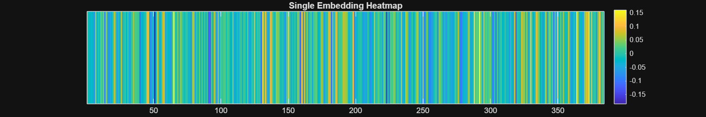

<a id="T_6c81"></a>

# Embeddings
<!-- Begin Toc -->

## Table of Contents
&emsp;&emsp;[Open\-source embedding model](#TMP_12b1)
 
&emsp;&emsp;[Semantic similarity](#TMP_4924)
 
&emsp;&emsp;[Vector Search](#H_06bf)
 
&emsp;&emsp;[Utils](#H_23b6)
 
<!-- End Toc -->

Resource: [The You You Are by Dr. Ricken Lazlo Hale, PhD on Apple Books](https://books.apple.com/us/book/the-you-you-are/id6738364141)

<a id="TMP_12b1"></a>

## Open\-source embedding model
```matlab
model = documentEmbedding(Model='all-MiniLM-L6-v2'); % or 'all-MiniLM-L12-v2'
quote1a = "What separates man from machine is that machines cannot think for themselves.";
embedding_quote1a = model.embed(quote1a)
```

```matlabTextOutput
embedding_quote1a = 1x384
    0.0039   -0.0150   -0.0280   -0.0170   -0.0243   -0.0678    0.0578   -0.0246    0.0006   -0.0144    0.0391    0.0092    0.0417   -0.0879    0.0430   -0.0592   -0.0660   -0.0397   -0.0314    0.0044    0.0724    0.0267   -0.0603   -0.0068   -0.0310    0.0683   -0.0407   -0.0076    0.0114   -0.0248    0.0181   -0.0430   -0.0367    0.0093    0.0529    0.0199    0.0243    0.0187    0.0101   -0.1098   -0.0335   -0.0296   -0.0132    0.0001    0.0876    0.1081   -0.0249   -0.0813   -0.0103   -0.0452

```

```matlab
plotSingleEmbedding(embedding_quote1a)
```



```matlab
quote1a = "What separates man from machine is that machines cannot think for themselves.";
quote1b = "Also they are made of metal, whereas man is made of skin.";
embedding_quote1a = model.embed(quote1a);
embedding_quote1b = model.embed(quote1b);
distance = dot(embedding_quote1a,embedding_quote1b)
```

```matlabTextOutput
distance = 0.3547
```

```matlab
plotAlignedEmbeddings(embedding_quote1a, embedding_quote1b)
```
<a id="TMP_4924"></a>

## Semantic similarity

Since the norm of the vector embeddings is 1, cosine similarity between the vectors results in a simple dot product.

```matlab
norm(embedding_quote1b)
```

```matlabTextOutput
ans = 1.0000
```

```matlab
dot(embedding_quote1a,embedding_quote1b)
```

```matlabTextOutput
ans = 0.3547
```

```matlab
dot(model.embed("Bullies"),model.embed("BULL and LIES"))
```

```matlabTextOutput
ans = 0.4531
```

```matlab
quote2 = "Bullies are nothing but BULL and LIES." ;
quote3 = "At the center of industry is (dust).";
dot(model.embed(quote2),model.embed(quote3))
```

```matlabTextOutput
ans = -0.0284
```

```matlab
dot(model.embed("industry"),model.embed("dust"))
```

```matlabTextOutput
ans = 0.3065
```

```matlab
% Define the paragraph as a string literal using concatenation for readability
paragraph = "It's said that as a child, Wolfgang Mozart killed another boy by slamming his head in a piano." + newline + ...
    "Don't worry, my research for this book has proven the claim untrue." + newline + ...
    "As your heart rate settles though, consider the power an author, heretofore referred to as Me, can hold over a reader, heretofore called You." + newline + ...
    "But what, indeed, is… You? All creatures from the leaping cat to the cowering shrew think of themselves as You, a logical center for the universe." + newline + ...
    "Yet the cat eats the shrew, and we, like Schrödinger, live on to wonder what it means." + newline + ...
    "I'm not asking out of mere politeness. For You, my friend, are no mere consumer of this book, sucking down nouns and adverbs like a plump babe to the teat." + newline + ...
    "In fact, your relationship to this work is far more intimate and profound." + newline + ...
    "You are its subject.";

% Split the paragraph into sentences 
sentences = splitlines(paragraph);

% Select the first sentence 
sentence1 = sentences(1)
```

```matlabTextOutput
sentence1 = "It's said that as a child, Wolfgang Mozart killed another boy by slamming his head in a piano."
```


Process the whole paragraph in one call

```matlab
embeddings = model.embed(sentences)
```

```matlabTextOutput
embeddings = 8x384
    0.0028    0.0890    0.0325    0.0031    0.0286    0.0859    0.0421    0.0474   -0.0152   -0.0094    0.0226   -0.0426   -0.0305   -0.0330   -0.0510   -0.0265   -0.0309    0.0679   -0.0474    0.0078    0.0045    0.0244    0.0339   -0.0331    0.0040    0.0697    0.0311   -0.0476   -0.0013    0.0533   -0.0093   -0.0708   -0.0018   -0.0778   -0.0844   -0.0134    0.0202   -0.0060   -0.0389    0.0206   -0.0318    0.1108   -0.1448    0.0136   -0.0384   -0.0222   -0.0780   -0.1006    0.0134    0.0259
   -0.0120   -0.0089    0.0003    0.0913    0.0021   -0.0226   -0.0261   -0.0467   -0.0523    0.0461    0.0127    0.0639    0.0792   -0.0358   -0.0666   -0.0137   -0.0815   -0.0239    0.0072    0.0033    0.0436    0.0220    0.1052    0.0441    0.0786   -0.1017    0.0192    0.0372   -0.0275   -0.0105   -0.0168    0.1218   -0.0278   -0.0408    0.0470    0.0103    0.0877    0.0098    0.0404    0.0016    0.0585   -0.1222    0.0283   -0.0011   -0.0420    0.0881   -0.0389   -0.0217   -0.0968   -0.0258
   -0.0485    0.0370   -0.0550    0.0622   -0.0651   -0.0024    0.1147   -0.0427    0.0953   -0.0579   -0.0591    0.0078   -0.0002   -0.0423    0.0066    0.0154    0.0561    0.0171   -0.0619    0.0560    0.0573    0.1233   -0.0454    0.0245   -0.0360   -0.0356   -0.0685   -0.0712    0.0102   -0.0338    0.0040   -0.0246   -0.0040   -0.0119   -0.0641    0.0917    0.0466    0.0239   -0.0219    0.0018   -0.0094   -0.0779    0.0449    0.0717    0.0143   -0.0329   -0.1145    0.0528   -0.0288    0.0411
    0.1042   -0.0802   -0.0001    0.0218    0.0174   -0.0805    0.0674   -0.0241    0.0417    0.0129   -0.0423   -0.1009   -0.0420    0.0053    0.0346   -0.0318   -0.0321   -0.0442   -0.0349    0.0402   -0.0415    0.0581    0.0006    0.0814   -0.0559    0.0550   -0.0013    0.0122   -0.0011   -0.0170    0.0206    0.0183   -0.0538    0.0442    0.0741    0.0198    0.0077   -0.0997    0.0711   -0.0515   -0.0009   -0.0995   -0.0348    0.0040   -0.0404    0.0923   -0.0583    0.0030    0.0117   -0.0367
    0.0777    0.0013    0.0109    0.0647   -0.0341   -0.0033    0.0240   -0.0156    0.0316   -0.0091    0.0073   -0.0427   -0.0350    0.0022   -0.0025   -0.0744   -0.0499   -0.0462    0.0031    0.0556    0.1260    0.0504    0.0418    0.0626   -0.0429    0.0610   -0.0343   -0.0435   -0.0298    0.0843   -0.0129    0.0150   -0.0318   -0.0259    0.0454    0.0024    0.0164    0.0093    0.0877   -0.0428   -0.0475   -0.0429   -0.0697   -0.0401   -0.1269   -0.0208   -0.0728   -0.0200   -0.0257   -0.0347
   -0.0191    0.0020    0.0791    0.0178   -0.0764   -0.0439    0.0409    0.0190   -0.0124    0.0356    0.0083    0.0206   -0.0030   -0.0455    0.0137   -0.0383   -0.0146    0.0046    0.0042   -0.0025   -0.0267    0.1090    0.0835   -0.0331   -0.0062   -0.1113    0.0362   -0.0656   -0.0328   -0.0124   -0.0733    0.0142   -0.0135   -0.0403   -0.0608    0.0318    0.1305   -0.0547    0.0789   -0.0392    0.0280   -0.0811   -0.0716    0.0744    0.0016    0.0646   -0.0219   -0.0263   -0.0407   -0.0472
   -0.0142    0.0594    0.0347   -0.0384   -0.0619   -0.0292   -0.0557   -0.0209    0.0812   -0.0330   -0.0510    0.0481   -0.0061    0.0457    0.0130    0.0216    0.0853   -0.0811   -0.1044    0.0428    0.0195    0.0378    0.0580   -0.0277    0.0273   -0.0062    0.0166   -0.0230    0.0021   -0.0316   -0.0619    0.0637    0.0292   -0.0204    0.0183    0.1000   -0.0353    0.0379    0.0485   -0.0675   -0.0354   -0.0140    0.0756    0.0422   -0.0361    0.0260   -0.0659   -0.1049   -0.0653   -0.0549
    0.0424    0.0875   -0.0261    0.0036    0.0609    0.0142    0.0660    0.0039   -0.0306    0.0597   -0.0993   -0.0715   -0.0556    0.0017    0.0591   -0.0732    0.0565   -0.0763   -0.0685    0.0407    0.0239    0.1040    0.0592   -0.0601   -0.0803    0.0190    0.0612    0.0106   -0.0148   -0.0544   -0.0571    0.1457    0.0401    0.0514   -0.0541    0.0828    0.0633   -0.0697    0.0594    0.0582    0.0406    0.0118    0.0240   -0.0223    0.0605    0.0214    0.0277    0.0054   -0.0301   -0.0474

```

<a id="H_06bf"></a>

## Vector Search
```matlab
% Encode the sentence "who are you"
query_sentence = "who are you";
query_embedding = model.embed(query_sentence);
distance = cosineSimilarity(query_embedding,embeddings)
```

```matlabTextOutput
distance = 1x8
    0.0175    0.1006    0.2865    0.2591    0.0575    0.1728    0.1485    0.3332

```

```matlab
[B,I] = sort(distance,"descend")
```

```matlabTextOutput
B = 1x8
    0.3332    0.2865    0.2591    0.1728    0.1485    0.1006    0.0575    0.0175

I = 1x8
     8     3     4     6     7     2     5     1

```

```matlab
sentences(I)
```

```matlabTextOutput
ans = 8x1 string
"You are its subject."                                                                                                                                     
"As your heart rate settles though, consider the power an author, heretofore referred to as Me, can hold over a reader, heretofore called You."            
"But what, indeed, is… You? All creatures from the leaping cat to the cowering shrew think of themselves as You, a logical center for the universe."       
"I'm not asking out of mere politeness. For You, my friend, are no mere consumer of this book, sucking down nouns and adverbs like a plump babe to the t…  
"In fact, your relationship to this work is far more intimate and profound."                                                                               
"Don't worry, my research for this book has proven the claim untrue."                                                                                      
"Yet the cat eats the shrew, and we, like Schrödinger, live on to wonder what it means."                                                                   
"It's said that as a child, Wolfgang Mozart killed another boy by slamming his head in a piano."                                                           

```


Let's use Facebook AI Similarity Search (FAISS)

```matlab
d = py.int(384); % Dimension of the embeddings
index = py.faiss.IndexFlatL2(d);
index.add(embeddings)
```

```matlab
% Save the index to a file
py.faiss.write_index(index, "you.index");
```

```matlab
% Later, load the index from the file
index = py.faiss.read_index("you.index");
```

```matlab
% Encode the sentence "who are you"
query_sentence = "who are you";
query_embedding = model.embed(query_sentence);

% Convert query_embedding to a numpy array and reshape to [1, 384]
query_embedding = py.numpy.reshape(query_embedding, py.tuple({py.int(1), d}));

k = py.int(3);  % Number of nearest neighbors to retrieve
res = index.search(query_embedding, k);
distance = double(res{1})
```

```matlabTextOutput
distance = 1x3
1.3337    1.4270    1.4818

```

```matlab
indices = int64(res{2})
```

```matlabTextOutput
indices = 1x3 int64 row vector
   7   2   3

```

```matlab
disp("Nearest neighbors (smaller is better):")
```

```matlabTextOutput
Nearest neighbors (smaller is better):
```

```matlab
% Loop over the number of neighbors returned.
% Note: FAISS returns 0-indexed indices, so add 1 for MATLAB indexing.
for i = 1:size(indices, 2)
    idx = indices(1, i) + 1;  
    % Use either sentences{idx} (if sentences is a cell array)
    % or sentences(idx) (if sentences is a string array)
    fprintf("Sentence: %s, Distance: %f\n", sentences{idx}, distance(1, i));
end
```

```matlabTextOutput
Sentence: You are its subject., Distance: 1.333668
Sentence: As your heart rate settles though, consider the power an author, heretofore referred to as Me, can hold over a reader, heretofore called You., Distance: 1.427042
Sentence: But what, indeed, is… You? All creatures from the leaping cat to the cowering shrew think of themselves as You, a logical center for the universe., Distance: 1.481814
```

<a id="H_23b6"></a>

## Utils

Function to visualize a single embedding as a heatmap

```matlab
function plotSingleEmbedding(embedding)
    % Create a figure with a custom size (in pixels)
    figure('Position', [100, 100, 1200, 200]);

    % Display the data as a heatmap
    imagesc(embedding);
    
    % Set a colormap 
    colormap("parula");
    
    % Remove y-axis ticks
    set(gca, 'YTick', []);
    
    % Add a colorbar to the side of the heatmap
    colorbar;
    
    % Set the title of the plot
    title('Single Embedding Heatmap');
end
```

Function to plot embeddings aligned

```matlab
function plotAlignedEmbeddings(embedding1, embedding2)
    % Stack the embeddings for aligned visualization 
    % (each embedding is assumed to be a row vector)
    aligned_embeddings = [embedding1; embedding2];
    
    % Create a figure with a custom size (in pixels)
    figure('Position', [100, 100, 1200, 200]);

    % Display the data as a heatmap
    imagesc(aligned_embeddings);
    
    % Set colormap
    colormap("parula");
    
    % Set the y-axis ticks to correspond to the two embeddings
    set(gca, 'YTick', [1, 2], 'YTickLabel', {'Embedding 1', 'Embedding 2'});
    
    % Remove x-axis ticks
    set(gca, 'XTick', []);
    
    % Add a colorbar to the side of the heatmap
    colorbar;
    
    % Set the title of the plot
    title('Aligned Embeddings Heatmap');
end
```

Function to compare one embedding over another

```matlab
function plotDifferenceEmbeddings(embedding1, embedding2)
    % Compute the difference between the embeddings
    difference = embedding1 - embedding2;
    
    % Create a figure with a custom size (in pixels)
    figure('Position', [100, 100, 1200, 200]);

    % Display the data as a heatmap
    imagesc(difference);
    
    % Set colormap 
    colormap(parula);
    
    % Remove x-axis and y-axis ticks for cleaner visualization
    set(gca, 'XTick', []);
    set(gca, 'YTick', []);
    
    % Add a colorbar to the side of the heatmap
    colorbar;
    
    % Set the title of the plot
    title('Embedding Difference Heatmap');
end
```
